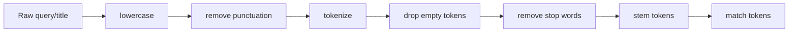

# Module 1: Preprocessing

## Lessons Learned

- **Setup:** set up the project before building search.
  - Create the `uv` project, create/activate `.venv`, keep `.venv` out of git, and install required packages such as `nltk`.
- **Keyword search:** start with simple exact matching.
  - It is fast, interpretable, and strong when exact words matter.
- **Preprocessing:** move from raw strings to normalized tokens.
  - `Bear`, `bear`, and `bear.` should usually behave like the same term.
  - The preprocessing pipeline is: lowercase, remove punctuation, tokenize, drop empty tokens, remove stop words, then stem.
- **Helpers:** put preprocessing in reusable functions.
  - Later indexing and ranking modules depend on reusing the same normalization rules.

---

## Setup and Context

The course starts by setting up `rag-search-engine` as a real Python project for Webflyx, a Netflix-like streaming service.

```bash
uv init rag-search-engine
cd rag-search-engine
uv venv
source .venv/bin/activate
uv add nltk==3.9.1
```

The early setup lesson is important: keep `.venv` out of git, let `pyproject.toml` / `uv.lock` describe dependencies, and install packages explicitly when the implementation needs them.

---

## Core Preprocessing Pipeline

The module moves search from raw substring matching to normalized token matching. Raw user input and raw movie titles are both pushed through the same helper before comparison.



By the end of the module, the core helper is conceptually:

```python
def tokenize_text(text: str) -> list[str]:
    text = text.lower()
    text = text.translate(str.maketrans("", "", string.punctuation))
    text = text.strip()
    text_tokens = text.split()
    return [token for token in text_tokens if token]
```

Then stemming is layered on top:

```python
def preprocess_text(text: str) -> list[str]:
    return [stemmer.stem(token) for token in tokenize_text(text)]
```

So the pipeline is encoded directly in helper functions that later search features reuse.

### 1. Naive keyword search

The first search command loaded `data/movies.json`, looped through movie titles, checked whether the title contained the query, and printed the first five matches.

The baseline implementation shape was:

```python
movies = load_movies()
results = []

for movie in movies:
    if query in movie["title"]:
        results.append(movie)
        if len(results) >= limit:
            break
```

Exact substring matching misses obvious case and word-form differences.

### 2. Lowercase text

Lowercasing makes matching case-insensitive:

```text
"The Matrix" -> "the matrix"
"HE IS HERE" -> "he is here"
```

Apply this to both the user query and the movie title:

```python
text = text.lower()
```

Once this lives inside `preprocess_text()` / `tokenize_text()`, search code does not lowercase every comparison manually.

### 3. Remove punctuation

Punctuation can block simple matches, so the code removes it before comparison:

```text
"Boots the bear!" -> "Boots the bear"
"The wonderful bear, Boots" -> "The wonderful bear Boots"
```

The implementation used:

```python
text.translate(str.maketrans("", "", string.punctuation))
```

This is intentionally simple. It works for early keyword search, even though cases like `sci-fi -> scifi` show that punctuation handling can have tradeoffs.

### 4. Tokenize

Tokenization splits text into searchable words:

```text
"The Matrix is a great movie!" -> ["the", "matrix", "is", "a", "great", "movie"]
```

The implementation strips surrounding whitespace, splits on general whitespace, and filters empty tokens:

```python
text = text.strip()
text_tokens = text.split()
return [token for token in text_tokens if token]
```

Using `.split()` without an argument splits on general whitespace.

The match also changes from "does the whole query appear in the title?" to "does any processed query token overlap with any processed title token?":

```python
any(
    query_token in title_token
    for query_token in preprocessed_query
    for title_token in preprocessed_title
)
```

### 5. Remove stop words

Stop words are common low-value words like:

```text
a
the
is
of
in
```

Without stop-word removal, `the bear` can incorrectly match `The Terminator` because of `the`. The implementation loads `data/stopwords.txt`, normalizes those words, and filters them out of query/title tokens.

The file-loading helper was:

```python
def load_stop_words() -> list[str]:
    with open(STOP_WORD_PATH, "r") as f:
        return f.read().splitlines()
```

Then the matching logic skips stop-word tokens:

```python
any(
    query_token in title_token
    for query_token in query_tokens
    for title_token in title_tokens
    if query_token not in stop_words and title_token not in stop_words
)
```

Stop words need the same normalization as regular text, so a word like `aren't` can become `arent` before comparison.

### 6. Stem tokens

Stemming reduces word variants to a shared stem:

```text
running, runs -> run
jumping, jumped -> jump
watching, watches -> watch
```

The repo uses NLTK's `PorterStemmer`:

```python
stemmer = PorterStemmer()
stemmer.stem(token)
```

In the preprocessing helper, every token is stemmed after tokenization:

```python
def preprocess_text(text: str) -> list[str]:
    return [stemmer.stem(token) for token in tokenize_text(text)]
```

Stemming is not semantic understanding, but it helps keyword search match simple word-form variations.

---

## Mental Model

Module 1 turns search from raw string comparison into normalized token comparison.

```text
query/title
    -> lowercase
    -> remove punctuation
    -> split into tokens
    -> remove empty tokens
    -> remove stop words
    -> stem tokens
    -> compare tokens
```

The core lesson:

```text
Search quality starts before ranking. If text is not normalized consistently, later ranking algorithms are built on unstable inputs.
```

---

## Implementation Notes

Main files involved:

- `cli/keyword_search_cli.py`
- `cli/lib/keyword_search.py`
- `cli/lib/search_utils.py`
- `data/movies.json`
- `data/stopwords.txt`
- `pyproject.toml`
- `uv.lock`

Relevant early commits:

- `712b4b7 Setup`: created the first CLI, movie loader, preprocessing helper, and search command.
- `db5bbb5 lesson 1.8`: added stop-word loading/filtering and the NLTK dependency.
- `889fddd lesson 1.9`: added `PorterStemmer` and split tokenization from preprocessing.

Useful commands:

```bash
uv init rag-search-engine
cd rag-search-engine
uv venv
source .venv/bin/activate
uv add nltk==3.9.1
uv run cli/keyword_search_cli.py search "great bear"
```
