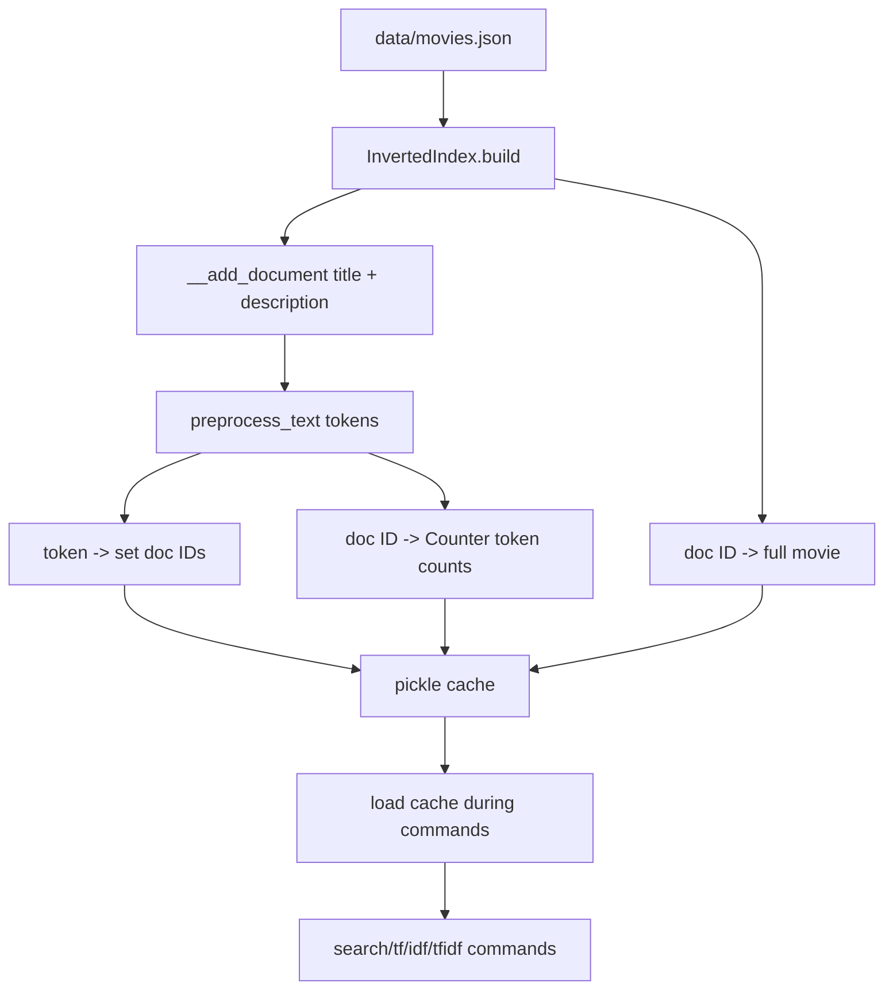

# Module 2: TF-IDF

## Formula Summary

| Concept | Formula | Meaning |
| ------- | ------- | ------- |
| Term frequency | `TF(term, doc) = count(term in doc)` | How many times a token appears in one document |
| Document frequency | `DF(term) = count(docs containing term)` | How many documents contain the token at least once |
| Inverse document frequency | `IDF(term) = log((N + 1) / (DF(term) + 1))` | Higher when a token appears in fewer documents, N = total number of docs, + 1 to stop dividing by 0 |
| TF-IDF | `TF-IDF(term, doc) = TF(term, doc) * IDF(term)` | Higher when a token is frequent in this document and rare overall |

## Lessons Learned

- **Inverted indexes:** change the search shape.
  - Instead of scanning every document, search looks up `token -> set(document IDs)`.
  - The docmap stores `document ID -> full movie object` so IDs can be turned back into results.
- **Caching:** build once, query many times.
  - Indexing is slower upfront, but lookup becomes fast.
  - `pickle` caching lets later commands load prepared structures instead of rebuilding.
- **TF:** measures local importance.
  - `TF(term, doc)` is how many times the term appears in one document.
- **IDF:** is a measure of how many documents contain a term.
  - `IDF(term)` is higher when fewer documents contain the term.
  - This reduces the value of common dataset-specific words.
- **TF-IDF:** combines both signals.
  - A term scores highest when it appears often in the current document and rarely across the corpus.

---

## Setup and Context

Module 1 searched by looping through every movie and comparing tokens. Module 2 changes the shape of the system: preprocess the dataset once, store lookup tables, and use those lookup tables for search and scoring.

The big shift is:

```text
Before: query -> loop through every movie -> compare title text
After:  query -> preprocess tokens -> look up matching doc IDs -> fetch movie objects
```

That shift matters because later ranking methods need more than "does this token appear?" They need counts, document frequencies, and reusable cached data.

---

## Core Indexing and Scoring Pipeline

The module builds a pipeline from raw movie documents to cached search structures, then layers TF, IDF, and TF-IDF on top.



`InvertedIndex` owns the searchable structures:

```python
class InvertedIndex:
    def __init__(self):
        self.index = defaultdict(set)
        self.docmap = {}
        self.term_frequencies = defaultdict(Counter)
```

### 1. Build an inverted index

A forward index maps location to value:

```text
document 1 -> ["matrix", "hacker", "reality"]
```

An inverted index maps value back to locations:

```text
matrix  -> [1, 5, 10]
hacker  -> [1, 8]
reality -> [1, 3, 7]
```

The repo builds that lookup by preprocessing each movie's title and description, then adding the movie ID to the set for each token:

```python
def __add_document(self, doc_id, text):
    tokens = preprocess_text(text)

    for token in tokens:
        self.index[token].add(doc_id)
```

Using a set means the same document ID is stored once per token, even if the token appears multiple times in that document.

### 2. Keep a docmap for full documents

The inverted index only stores document IDs. That keeps token lookup small, but search results need full movie objects so the CLI can print titles and IDs.

During build, the repo stores both:

```python
def build(self):
    movies = load_movies()
    for movie in movies:
        doc_id = movie["id"]
        self.docmap[doc_id] = movie
        self.__add_document(doc_id, f"{movie['title']} {movie['description']}")
```

The title and description are concatenated so a token can match either field.

### 3. Save and load the cache

Building the index requires reading and tokenizing the dataset, so the module saves the built structures to disk:

```python
def save(self):
    CACHE_DIR.mkdir(exist_ok=True)

    with open(self.index_path, "wb") as f:
        pickle.dump(self.index, f)

    with open(self.docmap_path, "wb") as f:
        pickle.dump(self.docmap, f)

    with open(self.tf_path, "wb") as f:
        pickle.dump(self.term_frequencies, f)
```

Then search can load the cache:

```python
def load(self):
    with open(self.index_path, "rb") as f:
        self.index = pickle.load(f)

    with open(self.docmap_path, "rb") as f:
        self.docmap = pickle.load(f)

    with open(self.tf_path, "rb") as f:
        self.term_frequencies = pickle.load(f)
```

Build the cache with:

```bash
uv run cli/keyword_search_cli.py build
```

### 4. Search by token lookup, not by scanning movies

After the index exists, search no longer needs to loop over every movie title. It can preprocess the query and ask the index for matching document IDs:

```python
processed_query = preprocess_text(query)

for q in processed_query:
    for doc_id in inverted_index.get_documents(q):
        results.append(inverted_index.docmap[doc_id])
```

The helper returns sorted document IDs:

```python
def get_documents(self, term):
    return sorted(self.index.get(term, set()))
```

The search command also tracks `seen_doc_ids` so a movie does not appear twice if multiple query tokens match the same document.

### 5. Track term frequency with Counter

Term frequency measures how many times a token appears in a document. It is useful because repeated terms can signal that the document is more about that topic.

The raw calculation is simple:

```text
TF(term, document) = count of term in that document
```

For example:

```text
Document: "students learn debugging and students practice search"

students -> 2
debugging -> 1
search -> 1
```

The repo stores term frequencies as:

```python
self.term_frequencies = defaultdict(Counter)
```

Then each token increments its count for that document:

```python
for token in tokens:
    self.index[token].add(doc_id)
    self.term_frequencies[doc_id][token] += 1
```

`Counter` behaves like a dictionary designed for counts:

```text
term_frequencies[4651]["merida"] -> how many times "merida" appears in Brave
```

The lookup method returns `0` when the document or token is missing:

```python
def get_tf(self, doc_id, term):
    return self.term_frequencies.get(doc_id, Counter()).get(term, 0)
```

CLI:

```bash
uv run cli/keyword_search_cli.py tf 4651 merida
```

### 6. Validate a single term before scoring

The TF, IDF, and TF-IDF commands expect one term, not a full query. The repo added a helper to enforce that:

```python
def tokenize_term(term: str) -> str:
    tokens = preprocess_text(term)
    if len(tokens) != 1:
        raise ValueError("Term must tokenize to exactly one token")
    return tokens[0]
```

This rejects ambiguous input like:

```bash
uv run cli/keyword_search_cli.py tf 4651 "merida brave"
```

Command inputs get normalized the same way indexed document tokens were normalized.

### 7. Calculate IDF across the corpus

Term frequency alone is easy to game and can overvalue common words. IDF fixes that by asking: "how rare is this term across all documents?"

The formula used in this module is:

```text
IDF(term) = log((N + 1) / (DF(term) + 1))
```

The pieces are:

```text
N = total number of documents in the dataset
DF(term) = number of documents that contain the term at least once
+1 = smoothing so missing terms do not cause division by zero
```

So if the dataset has `100` documents:

```text
rare term appears in 2 documents:
IDF = log((100 + 1) / (2 + 1))
    = log(101 / 3)
    ≈ 3.52

common term appears in 95 documents:
IDF = log((100 + 1) / (95 + 1))
    = log(101 / 96)
    ≈ 0.05

universal term appears in all 100 documents:
IDF = log((100 + 1) / (100 + 1))
    = log(1)
    = 0
```

In code:

```python
def calculate_idf(inverted_index: InvertedIndex, token: str) -> float:
    total_doc_count = len(inverted_index.docmap)
    term_match_doc_count = len(inverted_index.get_documents(token))
    return math.log((total_doc_count + 1) / (term_match_doc_count + 1))
```

CLI:

```bash
uv run cli/keyword_search_cli.py idf merida
```

### 8. Combine TF and IDF into TF-IDF

TF-IDF combines local importance and global rarity:

```text
TF-IDF(term, doc) = TF(term, doc) * IDF(term)
```

For example:

```text
Document A:
cyborg TF = 1
cyborg IDF = 3.9
TF-IDF = 1 * 3.9 = 3.9

Document B:
bear TF = 2
bear IDF = 0.05
TF-IDF = 2 * 0.05 = 0.1
```

Even though `bear` appears more times in Document B, `cyborg` can score higher because it is much rarer across the dataset.

In code:

```python
def calculate_tfidf(inverted_index: InvertedIndex, doc_id: int, token: str) -> float:
    tf = inverted_index.get_tf(doc_id, token)
    idf = calculate_idf(inverted_index, token)
    return tf * idf
```

CLI:

```bash
uv run cli/keyword_search_cli.py tfidf 4651 merida
```

---

## Mental Model

Module 2 changes the search engine from "look through text" to "query prepared statistics."

```text
Build phase:
    movies
        -> preprocess title + description
        -> index[token] = set(doc IDs)
        -> docmap[doc ID] = full movie
        -> term_frequencies[doc ID][token] = count
        -> pickle cache

Search/scoring phase:
    query/term
        -> preprocess
        -> load cache
        -> look up doc IDs or counts
        -> compute TF, IDF, or TF-IDF
```

The core lesson:

```text
Indexes make lookup fast.
Frequencies make ranking possible.
```

An inverted index tells us where a term appears. TF-IDF starts telling us how much that term should matter.

---

## Implementation Notes

Main files involved:

- `cli/lib/keyword_search.py`
- `cli/keyword_search_cli.py`
- `cache/index.pkl`
- `cache/docmap.pkl`
- `cache/term_frequencies.pkl`

Relevant commits:

- `623dc62 lesson 2.1`: added `InvertedIndex`, `build`, `save`, `get_documents`, and the CLI `build` command.
- `16b2929 lesson 2.2`: added `load`, switched search to use the cached index, and printed title plus ID.
- `3ad2cf5 lesson 4.4`: despite the label, this implemented Module 2 term-frequency work with `Counter`, `get_tf`, `tokenize_term`, and the `tf` command.
- `06c2e52 refactor`: replaced manual dictionary initialization with `defaultdict(set)` and `defaultdict(Counter)`, and centralized cache paths.
- `9aa191e lesson 2.5`: added the `idf` command and IDF formula.
- `87140bb lesson 2.6`: added `calculate_idf`, `calculate_tfidf`, and the `tfidf` command.

Useful commands:

```bash
uv run cli/keyword_search_cli.py build
uv run cli/keyword_search_cli.py search "furious fast"
uv run cli/keyword_search_cli.py tf 4651 merida
uv run cli/keyword_search_cli.py idf merida
uv run cli/keyword_search_cli.py tfidf 4651 merida
```
