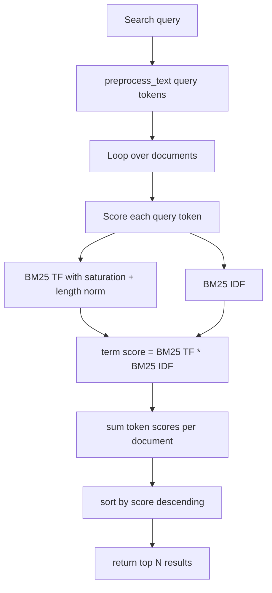

# Module 3: Keyword Search

## Formula Summary

| Concept | Formula | Meaning |
| ------- | ------- | ------- |
| Basic IDF | `log((N + 1)/(df + 1))` | Earlier IDF baseline; fails when `df = 0` and can overvalue extremely rare terms |
| BM25 IDF | `log((N - df + 0.5) / (df + 0.5) + 1)` | Uses smoothing so rare/common terms produce more controlled scores, using 0.5 constant, and numerator only has number docs WITHOUT term |
| BM25 TF saturation | `(tf * (k1 + 1)) / (tf + k1)` | Makes repeated terms give diminishing returns, normally `k1=1.5`, tends to (k1 + 1)  as tf -> ∞|
| Length normalization | `1 - b + b * (doc_length / avg_doc_length)` | Increases the denominator for long documents and lowers it for short documents, `b=0.75` is normal practice |
| BM25 TF with length norm | `(tf * (k1 + 1)) / (tf + k1 * length_norm)` | Combines term saturation with document length adjustment |
| Single term BM25 | `BM25(term, doc) = bm25_tf * bm25_idf` | Score for one query token in one document |
| Full query BM25 | `score(doc, query) = sum(BM25(term, doc) for term in query_tokens)` | Total score for ranking documents |

## Lessons Learned

- **BM25:** improves basic TF-IDF ranking.
  - It addresses three problems: unstable IDF edge cases, repeated-term overrewarding, and long-document bias.
- **BM25 IDF:** uses a better IDF formula.
  - Basic `log(N / df)` can divide by zero, overvalue extremely rare terms, and give `0` to terms that appear everywhere.
  - BM25 replaces it with `log((N - df + 0.5) / (df + 0.5) + 1)`.
- **Term-frequency saturation:** repeated terms give diminishing returns.
  - Repeating a term still helps, but each extra repetition helps less.
  - `k1 = 1.5` controls how quickly repeated term matches saturate.
- **Document length normalization:** accounts for long and short documents.
  - Long descriptions should not win only because they contain more words.
  - `b = 0.75` controls how strongly document length changes the score.
- **Full BM25 search:** sums per-token scores.
  - Each document is scored for each query token, token scores are summed, and results are sorted by total score.

---

## Setup and Context

Module 2 built TF-IDF:

```text
TF-IDF = TF * IDF
```

Module 3 keeps that same shape but replaces both pieces with BM25's improved versions:

```text
BM25 = bm25_tf * bm25_idf
```

The problems BM25 solves are specific:

- Basic IDF can divide by zero when `df = 0`, give very large scores for extremely rare terms, and give zero for terms that appear everywhere.
- Raw TF grows linearly, so a document can score much higher just by repeating the same word.
- Long documents naturally contain more words, so they can get more matches even when they are less focused.

BM25 is still keyword ranking, not semantic search. It does not understand meaning like an embedding model, but it ranks exact token matches better than raw TF-IDF because it controls repetition and document length.

---

## Core BM25 Scoring Pipeline

BM25 builds on the cached inverted index from Module 2. The index already knows which documents contain each token, how often each token appears, and which full movie object belongs to each document ID. Module 3 adds document lengths and improved scoring formulas.



### 1. Replace basic IDF with BM25 IDF

Basic TF-IDF used:

```text
IDF(term) = log(N / df)
```

That has edge cases:

- `df = 0` can cause division by zero.
- extremely rare terms can get very large scores.
- terms appearing in every document can bottom out at zero.

BM25 uses:

```text
BM25_IDF(term) = log((N - df + 0.5) / (df + 0.5) + 1)
```

The pieces are:

```text
N = total document count
df = number of documents containing the term
N - df = number of documents not containing the term
0.5 = smoothing
+ 1 = keeps the final value positive
```

Worked example with `N = 100`:

```text
rare term, df = 2:
BM25 IDF = log((100 - 2 + 0.5) / (2 + 0.5) + 1)
         = log(98.5 / 2.5 + 1)
         = log(40.4)
         ≈ 3.70

common term, df = 95:
BM25 IDF = log((100 - 95 + 0.5) / (95 + 0.5) + 1)
         = log(5.5 / 95.5 + 1)
         ≈ 0.06
```

In code:

```python
def get_bm25_idf(self, term: str) -> float:
    df = len(self.index[term])
    N = len(self.docmap)
    return math.log((N - df + 0.5) / (df + 0.5) + 1)
```

Command:

```bash
uv run cli/keyword_search_cli.py bm25idf merida
```

### 2. Add term-frequency saturation

Raw TF grows linearly. A term appearing `100` times gets ten times more weight than a term appearing `10` times. That can reward keyword stuffing.

BM25 uses diminishing returns:

```text
BM25_TF(term, doc) = (tf * (k1 + 1)) / (tf + k1)
```

With `k1 = 1.5`:

| Raw TF | Basic TF | BM25 TF |
| ------ | -------- | ------- |
| 1 | 1 | 1.00 |
| 2 | 2 | 1.43 |
| 5 | 5 | 1.92 |
| 10 | 10 | 2.17 |
| 20 | 20 | 2.33 |

The first few occurrences matter a lot, but the score flattens as repetitions pile up.

In code, the first version was:

```python
def get_bm25_tf(self, doc_id, term, k1=BM25_K1):
    tf = self.get_tf(doc_id, term)
    return (tf * (k1 + 1)) / (tf + k1)
```

Command:

```bash
uv run cli/keyword_search_cli.py bm25tf 4651 merida
```

### 3. Track document lengths

Longer documents naturally contain more words, which can create higher term frequencies even when the document is less focused.

To fix that, the index records how many preprocessed tokens each document has:

```python
def __add_document(self, doc_id, text):
    tokens = preprocess_text(text)
    self.doc_lengths[doc_id] = len(tokens)

    for token in tokens:
        self.index[token].add(doc_id)
        self.term_frequencies[doc_id][token] += 1
```

The average document length is:

```python
def __get_avg_doc_length(self) -> float:
    if not self.doc_lengths or len(self.doc_lengths) == 0:
        return 0.0
    return sum(self.doc_lengths.values()) / len(self.doc_lengths)
```

### 4. Normalize by document length

BM25 calculates a length normalization factor:

```text
length_norm(doc) = 1 - b + b * (doc_length / avg_doc_length)
```

The length ratio is:

```text
doc_length / avg_doc_length
```

| Ratio | Meaning | Effect |
| ----- | ------- | ------ |
| `1.0` | average-length document | neutral |
| `> 1.0` | longer than average | penalized |
| `< 1.0` | shorter than average | boosted |

Worked example with `b = 0.75`:

```text
avg_doc_length = 100

short document, doc_length = 50:
length_norm = 1 - 0.75 + 0.75 * (50 / 100)
            = 0.25 + 0.375
            = 0.625

long document, doc_length = 200:
length_norm = 1 - 0.75 + 0.75 * (200 / 100)
            = 0.25 + 1.5
            = 1.75
```

The full BM25 TF formula becomes:

```text
BM25_TF(term, doc) = (tf * (k1 + 1)) / (tf + k1 * length_norm(doc))
```

In code:

```python
def get_bm25_tf(self, doc_id, term, k1=BM25_K1, b=BM25_B):
    doc_length = self.doc_lengths.get(doc_id, 0)
    avg_doc_length = self.__get_avg_doc_length()
    if avg_doc_length > 0:
        length_norm = 1 - b + b * (doc_length / avg_doc_length)
    else:
        length_norm = 1
    tf = self.get_tf(doc_id, term)
    return (tf * (k1 + 1)) / (tf + k1 * length_norm)
```

### 5. Combine BM25 TF and BM25 IDF

Like TF-IDF, BM25 multiplies a term-frequency component by an inverse-document-frequency component:

```text
BM25(term, document) = bm25_tf * bm25_idf
```

In code:

```python
def bm25(self, doc_id: str, term: str):
    bm_tf = self.get_bm25_tf(doc_id, term)
    bm_idf = self.get_bm25_idf(term)
    return bm_tf * bm_idf
```

### 6. Search by summing BM25 over query tokens

The full BM25 search algorithm is:

1. Preprocess the query into tokens.
2. For each document, calculate BM25 for each query token.
3. Sum those token scores into a total document score.
4. Sort documents by total score descending.
5. Return the top `limit` documents.

```text
score(doc, query) = sum(BM25(term, doc) for term in query_tokens)
```

CLI:

```bash
uv run cli/keyword_search_cli.py bm25search "animated family"
```

---

## Mental Model

Module 3 upgrades TF-IDF into BM25 by controlling three ranking problems:

```text
Basic TF-IDF:
    term score = raw TF * basic IDF

BM25:
    term score =
        saturated TF
        adjusted by document length
        multiplied by smoother IDF

Full query score:
    document score = sum(BM25(term, document) for each query token)
```

The core lesson:

```text
BM25 is still keyword search, but its scores are controlled.

It rewards rare matching terms, reduces the extra benefit from repeated terms, and adjusts for document length.
```

---

## Implementation Notes

Main files involved:

- `cli/lib/keyword_search.py`
- `cli/keyword_search_cli.py`
- `cli/lib/search_utils.py`
- `cache/doc_lengths.pkl`

Relevant commits:

- `ad12904 lesson 3.2`: added BM25 IDF and the `bm25idf` command.
- `e9e6795 lesson 3.3`: added `BM25_K1`, BM25 TF saturation, and the `bm25tf` command.
- `0f13d01 lesson 3.3`: added `BM25_B`, document lengths, average document length, length-normalized BM25 TF, and cached `doc_lengths`.
- `9f33e22 lesson 3.4`: added full `bm25`, `bm25_search`, `bm25search`, and stop-word filtering inside `preprocess_text()`.

Useful commands:

```bash
uv run cli/keyword_search_cli.py build
uv run cli/keyword_search_cli.py bm25idf merida
uv run cli/keyword_search_cli.py bm25tf 4651 merida
uv run cli/keyword_search_cli.py bm25search "animated family"
```
