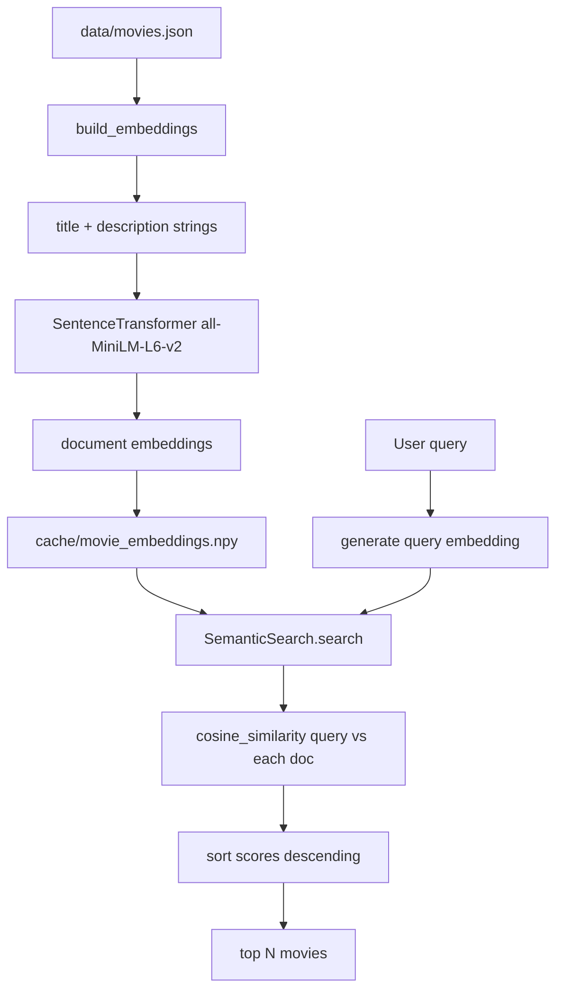

# Module 4: Semantic Search

## Formula Summary

| Concept | Formula | Meaning |
| ------- | ------- | ------- |
| Vector addition | `[a1, a2] + [b1, b2] = [a1 + b1, a2 + b2]` | Combines concepts |
| Vector subtraction | `[a1, a2] - [b1, b2] = [a1 - b1, a2 - b2]` | Removes concepts |
| Dot product | `A · B = sum(A[i] * B[i])` | Measures alignment, but is affected by vector magnitude |
| Euclidean norm | `||A|| = sqrt(sum(A[i]^2))` | Measures vector length |
| Cosine similarity | `cos(A, B) = (A · B) / (||A|| * ||B||)` | Measures direction similarity while reducing length bias |
| Semantic search score | `score(query, doc) = cosine_similarity(query_embedding, doc_embedding)` | Ranks documents by vector similarity |

## Lessons Learned

- **Semantic search:** matches meaning, not just tokens.
  - It can retrieve conceptually related movies even when the exact query words do not appear.
- **Embeddings:** represent text as vectors.
  - Vector dimensions are learned mathematical coordinates, not human-readable labels.
  - Similar meanings should land near each other or point in similar directions.
- **Shared embedding model:** documents and queries must use the same model.
  - Otherwise their vectors live in incompatible spaces.
  - This repo uses `all-MiniLM-L6-v2` as a small local starter model.
- **Cosine similarity:** ranks vector matches.
  - Dot product measures alignment, but cosine similarity compares direction while controlling for vector length.
- **Two-phase search:** semantic search has a build phase and a query phase.
  - Build once: embed movie documents and cache `cache/movie_embeddings.npy`.
  - Query each time: embed the query, compare against document vectors, sort by similarity.
- **Scale limit:** brute-force vector search does not scale forever.
  - For large datasets, approximate indexes or vector databases are used to avoid scanning every vector.

---

## Setup and Context

The earlier modules built lexical search. Lexical search works when the relevant words are literally present, but it misses meaning-based matches.

Example:

```text
Query: "exciting adventure"

Keyword search looks for:
    "exciting" and/or "adventure"

Semantic search can also match:
    "thrilling journey"
    "suspenseful expedition"
    "action-packed quest"
```

That is the main reason this module introduces embeddings. Instead of representing a movie as searchable tokens, semantic search represents both movies and queries as vectors.


---

## Core Semantic Search Pipeline

The module turns Webflyx movie search into a vector comparison problem.



The core class owns the model, documents, document map, and embeddings:

```python
class SemanticSearch:
    def __init__(self, model_name: str = "all-MiniLM-L6-v2"):
        self.model = SentenceTransformer(model_name)
        self.embeddings = None
        self.documents = None
        self.document_map = {}
```

### 1. Semantic search solves a different problem from keyword search

Keyword search is precise when exact words matter:

```text
Query: "The Matrix"
Good behavior: find the exact title
```

Semantic search is better when the user expresses a concept:

```text
Query: "happy movies"
Useful matches: joyful, uplifting, lighthearted films
```

The exact failure mode of keyword search is that it cannot match meaning unless the right words appear in the searchable text. Semantic search fixes that by comparing vector representations of meaning.

### 2. Embeddings turn text into vectors

An embedding is a list of numbers produced by a model:

```text
"The Great Bear" -> [0.2, -0.8, 0.1, 0.7, ...]
```

The numbers are coordinates in a learned mathematical space. Texts with similar meanings should have vectors that are close together or point in similar directions.

This module uses a pre-trained model instead of training one from scratch:

```python
from sentence_transformers import SentenceTransformer

self.model = SentenceTransformer("all-MiniLM-L6-v2")
```

The course uses `all-MiniLM-L6-v2` because it is small, fast, local after the first download, and reasonable for general-purpose search.

### 3. Dimensions are coordinates, not human-readable features

In 2D, a vector like `[3, 2]` means "3 units right, 2 units up." Embedding vectors work the same mathematically, but with hundreds of dimensions.

They are learned numerical features. What matters is that similar text lands near similar text in vector space.

### 4. Vector operations combine or remove concepts

Vector addition and subtraction happen element by element:

```text
add_vectors(A, B)[i] = A[i] + B[i]
subtract_vectors(A, B)[i] = A[i] - B[i]
```

Vectors must have the same length for these element-wise operations.

### 5. Dot product measures alignment

The dot product multiplies corresponding elements and sums the products:

```text
A = [0.8, 0.5, 0.5]
B = [0.5, 0.4, 0.6]

A · B = (0.8 * 0.5) + (0.5 * 0.4) + (0.5 * 0.6)
      = 0.4 + 0.2 + 0.3
      = 0.9
```

Formula:

```text
dot(A, B) = sum(A[i] * B[i])
```

The problem is that dot product is affected by both direction and magnitude. For semantic search, direction is usually the part we care about most.

### 6. Cosine similarity compares direction

Cosine similarity divides the dot product by the lengths of the vectors:

```text
cosine_similarity(A, B) = dot(A, B) / (magnitude(A) * magnitude(B))
```

Where magnitude is:

```text
magnitude(A) = sqrt(sum(A[i]^2))
```

Worked example:

```text
A = [0.6, 0.8]
B = [3.0, 4.0]

dot(A, B) = 0.6*3.0 + 0.8*4.0 = 5.0
magnitude(A) = sqrt(0.6^2 + 0.8^2) = 1.0
magnitude(B) = sqrt(3.0^2 + 4.0^2) = 5.0

cosine_similarity = 5.0 / (1.0 * 5.0) = 1.0
```

The repo implementation uses NumPy:

```python
def cosine_similarity(vec1: np.ndarray, vec2: np.ndarray) -> float:
    dot_product = np.dot(vec1, vec2)
    norm1 = np.linalg.norm(vec1)
    norm2 = np.linalg.norm(vec2)

    if norm1 == 0 or norm2 == 0:
        return 0.0

    return dot_product / (norm1 * norm2)
```

The zero-norm check prevents division by zero.

### 7. Generate embeddings for single text inputs

The model expects a list of text inputs and returns a list/array of embeddings. For a single string, the code wraps the text in a list and returns the first embedding:

```python
def generate_embedding(self, text):
    if not text.strip():
        raise ValueError("no text provided to embed")
    embedding = self.model.encode([text])
    return embedding[0]
```

Embedding models have their own tokenizer, so this helper mainly validates that the input is not empty.

### 8. Build and cache document embeddings

Document embeddings are expensive enough that they should be built once and reused. The module turns each movie into one string:

```python
f"{doc['title']}: {doc['description']}"
```

Then the model embeds all movie strings and saves them:

```python
movie_strings.append(f"{doc['title']}: {doc['description']}")
self.embeddings = self.model.encode(movie_strings, show_progress_bar=True)
np.save(CACHE_DIR / "movie_embeddings.npy", self.embeddings)
```

The saved `.npy` file acts as a simple vector store for this course project.

### 9. Load cached embeddings when possible

Search should not rebuild movie embeddings every time. The module checks for `cache/movie_embeddings.npy`, loads it when possible, and rebuilds if the cached vector count does not match the number of documents.

### 10. Use the same model for documents and queries

Documents and queries must be embedded with the same model:

```python
model = SentenceTransformer("all-MiniLM-L6-v2")
doc_embeddings = model.encode(documents)
query_embedding = model.encode([query])
```

Different models create different vector spaces. Comparing vectors from two models is not meaningful because each model learned its own coordinate system.

Rule:

```text
same embedding model for documents + queries
same similarity metric the model expects
```

### 11. Implement semantic search

Semantic search is brute-force in this repo: compare the query vector against every movie vector, sort all scores, and return the top results.

```python
query_embedding = self.generate_embedding(query)

for i in range(len(self.embeddings)):
    similarity_score = cosine_similarity(query_embedding, self.embeddings[i])
    search_results.append((similarity_score, self.documents[i]))

search_results.sort(key=lambda result: result[0], reverse=True)
```

Command:

```bash
uv run cli/semantic_search_cli.py search "space adventure" --limit 5
```

### 12. Know when this needs a real vector database

For a small movie dataset, comparing every query against every vector is fine. For millions or billions of documents, scanning every vector is too slow. The course points toward locality-sensitive hashing and vector databases as production-scale options.

---

## Mental Model

Module 4 changes retrieval from token matching to vector similarity.

```text
Build phase:
    movie title + description
        -> embedding model
        -> document vector
        -> cache/movie_embeddings.npy

Search phase:
    user query
        -> same embedding model
        -> query vector
        -> cosine similarity against each document vector
        -> sort by similarity
        -> top results
```

The core lesson:

```text
Keyword search asks: "Do the words match?"
Semantic search asks: "Do the meanings point in the same direction?"
```

Cosine similarity is the bridge between those two pieces of text after the embedding model has converted them into vectors.

---

## Implementation Notes

Main files involved:

- `cli/lib/semantic_search.py`
- `cli/semantic_search_cli.py`
- `cli/lib/search_utils.py`
- `cache/movie_embeddings.npy`
- `pyproject.toml`
- `uv.lock`

Relevant commits:

- `94b576d lesson 4.1, 4.3, 4.11, 4.12`: added semantic search CLI, `SemanticSearch`, model verification, text/query embedding, document embedding cache, and dependencies.
- `77d880b lessons 4.15`: added cosine-similarity semantic search, result ranking, `--limit`, and CLI output for search results.

Useful commands:

```bash
uv add sentence-transformers
uv add numpy
uv run cli/semantic_search_cli.py verify
uv run cli/semantic_search_cli.py embed_text "Paddington is a joyful bear movie"
uv run cli/semantic_search_cli.py verify_embeddings
uv run cli/semantic_search_cli.py embed_query "space adventure"
uv run cli/semantic_search_cli.py search "space adventure" --limit 5
```
