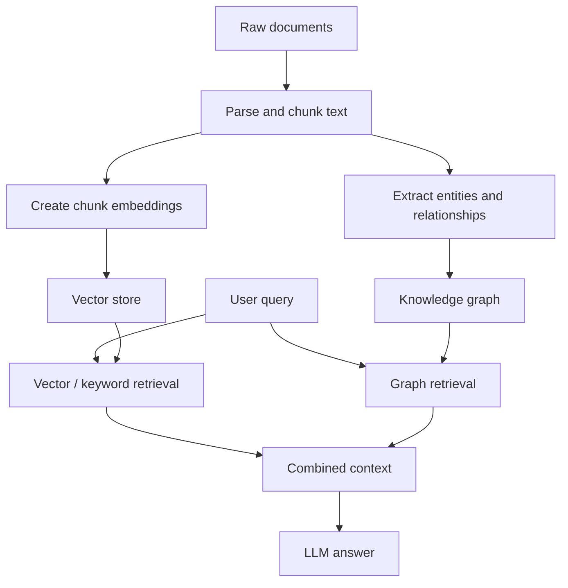
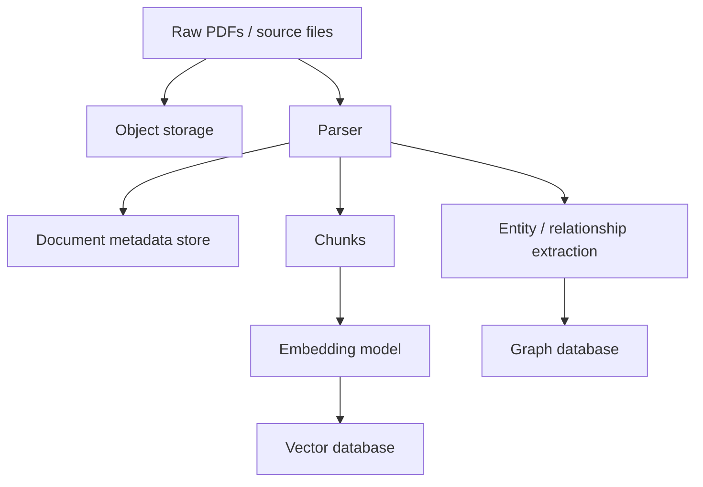

# Module 4c: GraphRAG And Relationship Retrieval

## Lessons Learned

- **Vector retrieval:** answers similarity questions.
  - It is good at finding chunks that are semantically close to a query.
  - It is weaker when the answer depends on relationships between entities, documents, sections, clauses, or cells.
- **Graph retrieval:** answers relationship questions.
  - It stores things as nodes and edges, then retrieves by traversing connections.
  - This matters when the structure of the data is part of the answer.
- **GraphRAG:** combines retrieval from text with retrieval from relationships.
  - A graph can help the system find related entities, dependencies, communities, and paths that plain vector search may miss.
  - It is especially useful when the user asks broad, multi-hop, or relationship-heavy questions.
- **Graph databases:** become relevant when the graph is too important or too large to keep only in memory.
  - `networkx` is useful for prototyping and algorithm work.
  - Neo4j, Memgraph, Amazon Neptune, ArangoDB, or PostgreSQL with graph extensions are more relevant when the graph needs persistence, queries, concurrency, and production access.
- **Storage architecture:** production RAG is often more than a vector database.
  - Raw files, parsed document metadata, embeddings, and graph relationships may live in different stores.

---

## Why GraphRAG Is A Separate Idea

Module 4b focused on this question:

```text
Given a query embedding, which stored chunk embeddings are closest?
```

That is the core semantic-search problem. It works well when the answer is likely to be contained in one or more text chunks.

GraphRAG adds a different question:

```text
What connected facts, entities, documents, sections, or dependencies should be followed?
```

That distinction matters because not all retrieval problems are just nearest-neighbor problems.

Example:

```text
Question:
    "Which companies mention AI risk and also depend heavily on cloud infrastructure?"

Vector search:
    Find chunks similar to "AI risk" and "cloud infrastructure".

Graph retrieval:
    Traverse relationships between companies, filings, risk sections,
    business segments, suppliers, products, and concepts.
```

The vector store finds relevant text. The graph helps preserve and query the relationships between pieces of information.

---

## The Core GraphRAG Flow

GraphRAG usually adds an extraction and graph-building phase before retrieval.



The important shift is that retrieval can now use two kinds of evidence:

- **Text evidence:** chunks that directly discuss the query.
- **Relationship evidence:** connected nodes, edges, paths, or communities that explain how pieces fit together.

---

## 1. Graphs Store Nodes And Edges

A graph represents data as:

```text
nodes:
    Company
    Filing
    Section
    Risk
    Product
    Person
    Spreadsheet cell

edges:
    FILED
    CONTAINS_SECTION
    MENTIONS
    DEPENDS_ON
    OWNS
    REFERENCES
```

For a document RAG system:

```text
Apple -> FILED -> 2024 10-K
2024 10-K -> CONTAINS_SECTION -> Risk Factors
Risk Factors -> MENTIONS -> Supply chain disruption
Supply chain disruption -> RELATED_TO -> China
```

For a spreadsheet or workbook system:

```text
Cell B10 -> DEPENDS_ON -> Cell B9
Cell B9 -> DEPENDS_ON -> Cell B3
Sheet Forecast -> REFERENCES -> Sheet Assumptions
```

That second example is why graph storage is relevant to your own project. A workbook dependency graph or DAG can start in `networkx`, but a production system may need a database that can persist and query those relationships.

---

## 2. Graph Databases Store Relationship Queries

`networkx` is useful when the graph is local and in memory:

```text
Python process
    -> networkx graph
    -> graph algorithms
```

That is good for prototyping. The limitation is that the graph disappears when the process ends unless you save it yourself, and it is not designed as a multi-user production database.

A graph database adds:

- persistent graph storage
- graph query language
- indexing
- concurrent access
- APIs
- backups and operations

Neo4j is the most common graph database to learn first. It uses the Cypher query language:

```cypher
MATCH (c:Company)-[:FILED]->(f:Filing)-[:CONTAINS_SECTION]->(s:Section)
WHERE c.name = "Microsoft" AND f.year = 2024
RETURN s.title, s.text
```

The point is not that every RAG project needs Neo4j. The point is that graph databases become useful when relationships are first-class data, not just helper objects inside Python.

---

## 3. Microsoft GraphRAG Is A Pipeline, Not A Database

Microsoft GraphRAG is not the same kind of thing as Neo4j.

```text
Neo4j:
    database for storing and querying graphs

Microsoft GraphRAG:
    pipeline for extracting graph structure from text,
    summarizing communities,
    and using that graph structure during retrieval
```

The Microsoft approach is useful to understand because it turns unstructured text into a graph-based retrieval layer:

1. Extract entities and relationships from documents.
2. Build a knowledge graph.
3. Detect communities or clusters inside the graph.
4. Summarize those communities.
5. Use the graph and summaries to augment prompts at query time.

This is especially useful for broad questions over a whole corpus.

Example:

```text
"What are the main themes in the company's risk disclosures over time?"
```

Plain vector search can retrieve a handful of similar chunks. GraphRAG can help organize related entities and themes across many documents before the LLM answers.

---

## 4. Property Graph RAG

A property graph stores nodes and edges with labels and attributes:

```text
(Company {name: "Microsoft"})
    -[:FILED {year: 2024}]->
(Filing {type: "10-K"})
```

Frameworks like LlamaIndex and LangChain can connect retrieval code to graph databases such as Neo4j. The general shape is:

```text
Documents
    -> extract nodes and relationships
    -> store graph in Neo4j
    -> retrieve paths/subgraphs for a query
    -> combine with vector search results
    -> pass context to the LLM
```

This is useful when a question needs more than isolated chunks:

```text
"Which risk factors are connected to revenue concentration and supplier dependency?"
```

A vector search may find chunks about each topic separately. A graph retriever can follow edges between companies, suppliers, risk sections, metrics, and time periods.

---

## 5. Storage Layers In A Production RAG System

Production RAG systems often have more than one storage layer.



Common layers:

| Layer | Examples | Stores |
| ----- | -------- | ------ |
| **Object storage** | S3, Azure Blob, GCS, MinIO | Original PDFs, filings, source files |
| **Document metadata store** | PostgreSQL, MongoDB | Parsed structure, page numbers, sections, provenance |
| **Vector store** | Qdrant, Pinecone, Chroma, LanceDB, pgvector | Chunk embeddings, IDs, text, retrieval metadata |
| **Graph store** | Neo4j, Memgraph, Neptune, ArangoDB, Apache AGE | Entities, relationships, dependencies, paths |

This is the missing piece in a simple "relational versus vector" explanation. A realistic RAG system may need raw files, structured metadata, vector retrieval, and graph retrieval.

---

## 6. Tools Worth Knowing

| Tool | Category | Main Use |
| ---- | -------- | -------- |
| **Neo4j** | Graph database | Production graph storage and Cypher queries |
| **Memgraph** | Graph database | Real-time graph database with Cypher-style querying |
| **Amazon Neptune** | Managed graph database | AWS-managed graph workloads |
| **ArangoDB** | Multi-model database | Document, key-value, and graph data in one system |
| **Apache AGE** | PostgreSQL graph extension | Graph querying inside PostgreSQL |
| **Microsoft GraphRAG** | GraphRAG pipeline | Build graph/community summaries from text corpora |
| **LlamaIndex Property Graph Index** | GraphRAG framework | Build/query property graphs and combine graph retrievers |
| **LangChain + Neo4j** | GraphRAG integration | Use Neo4j as a graph source inside LangChain apps |

For your project, the first tools to understand are probably:

1. **Neo4j:** because it is the clearest production graph database option.
2. **Microsoft GraphRAG:** because it explains corpus-level graph retrieval and community summaries.
3. **LlamaIndex property graphs:** because they show how graph retrieval fits into a RAG framework.
4. **PostgreSQL edge tables or Apache AGE:** because keeping the stack small may matter during a dissertation build.

---

## When To Use GraphRAG

Use ordinary vector or hybrid search when:

- the answer is likely to be in a small number of chunks
- approximate semantic relevance is enough
- relationships between documents are not the main retrieval signal

Use GraphRAG when:

- the answer depends on **relationships** between entities
- the query requires **multi-hop retrieval**
- the corpus has important **structure** such as citations, dependencies, ownership, references, or hierarchies
- the user asks broad questions over a whole collection

Examples:

- **Finance:** connect companies, filings, risk factors, business segments, suppliers, and time periods.
- **Legal:** connect clauses, definitions, obligations, exceptions, parties, and referenced documents.
- **Scientific literature:** connect papers, methods, findings, datasets, citations, and contradictory claims.
- **Spreadsheets:** connect cells, formulas, worksheets, assumptions, and downstream outputs.

Do not use GraphRAG just because it sounds more advanced. It adds extraction cost, schema decisions, graph cleaning, entity deduplication, storage complexity, and harder evaluation.

---

## Mental Model

Think of retrieval as three complementary signals:

```text
Keyword search:
    "Which documents contain these terms?"

Vector search:
    "Which documents mean something similar?"

Graph search:
    "Which facts are connected?"
```

GraphRAG matters when the third question is central to the answer.

For a thesis architecture:

```text
Experiment 1:
    semantic / hybrid RAG over document chunks

Experiment 2:
    GraphRAG over entities, dependencies, citations, clauses, or workbook DAGs
```

The practical rule:

```text
If relationships are just metadata, keep them in relational tables.
If relationships are the retrieval path, model them as a graph.
```
