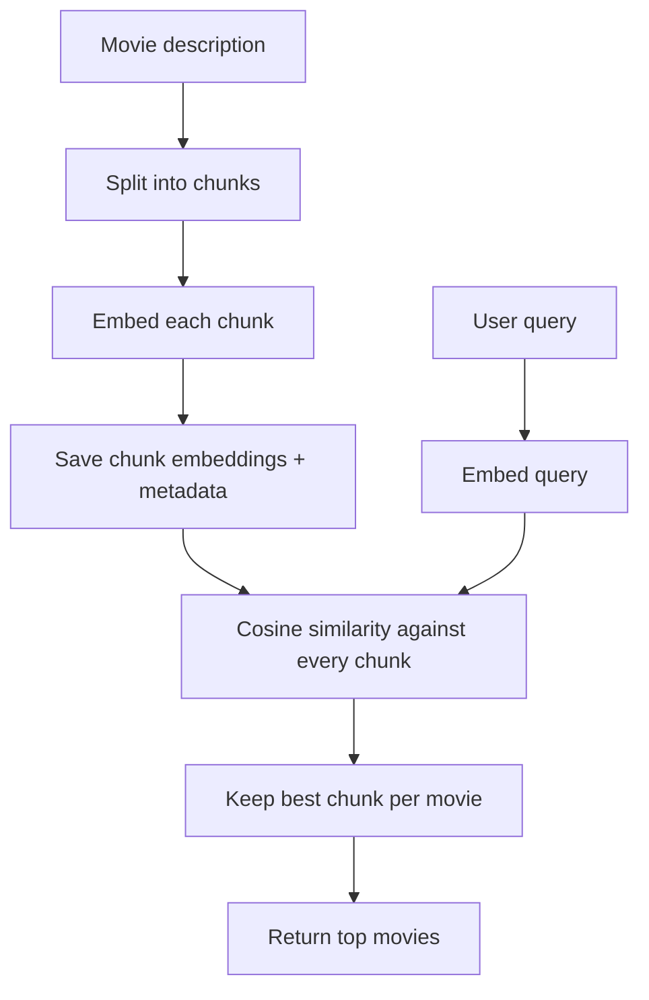

# Module 5: Chunking

## Lessons Learned

- **Whole-document embeddings:** can be too broad.
  - If a description covers many topics or is very long, one vector can blur the specific passage the user needs.
  - Leads to: token limits for LLMs, poor precision (as specific concepts get 'averaged out' - semantic dilution), irrelevant matches
- **Fixed-size chunking:** makes retrieval more local.
  - It helps with token limits, fast, predictable size.
  - Its weakness is that it can split important context across boundaries.
- **Overlap and semantic chunking:** improve chunk quality.
  - Overlap repeats the end of one chunk at the start of the next.
    - check implementation for edge cases, below
    - Determine overlap with own data, but good rule of thumb is `20%`
  - Semantic chunking splits around sentences instead of arbitrary words (not actually semantic - just uses regex to split chunks by sentences).

- **Chunked semantic search:** ranks movies by their best chunk.
  - Embed each chunk, score each chunk against the query, then keep the highest-scoring chunk per movie.
  - Metadata maps each chunk back to its movie, chunk index, and total chunk count.
  - EDGE CASES: 
    - view the chunks manually to see if chunked correctly: human writing has infinite edge cases
- **ColBERT and late chunking:** are advanced alternatives.
  - They preserve more fine-grained context or precision than one normal chunk vector, but cost more complexity.

---

## Setup and Context

Module 4 embedded each movie as one document vector:

```text
movie title + full description -> one embedding
```

That works when documents are short and focused. It gets weaker when a document contains several ideas. A single vector has to represent the whole description, so a very specific query may match poorly even when one passage is relevant.

Chunking changes the retrieval unit:

```text
one movie -> many chunks -> many embeddings
```

Then search asks:

```text
Which chunk is closest to the query?
```

The final result is still a movie, but the score comes from the movie's best matching chunk.



---

## Core Chunked Search Pipeline

### 1. Fixed-size chunking splits text into word windows

The first version of chunking is mechanical: split on whitespace, take `chunk_size` words at a time, and print each chunk.

```python
def chunk_text(text, chunk_size, overlap):
    text_list = text.split(" ")
    chunks = chunking(text_list, chunk_size, overlap)
    print(f"Chunking {len(text)} characters")
    for i, chunk in enumerate(chunks):
        print(f"{i+1}. {chunk}")
    return chunks
```

The shared helper tracks a moving start index:

```python
start = 0

while start < len(text_list):
    chunk_words = text_list[start: start + chunk_size]
    chunks.append(" ".join(chunk_words))
    start = start - overlap + chunk_size
```

If `chunk_size = 10`, the first chunk gets words `0..9`, the second gets words `10..19`, and so on.

### 2. Overlap preserves boundary context

The problem with fixed chunks is that useful meaning can be split between two chunks.

```text
Chunk 1: The princess Merida challenges an old tradition
Chunk 2: and accidentally puts her family in danger
```

A query about "Merida family danger" needs words from both chunks. Overlap keeps some words from the previous chunk when making the next chunk.

```python
start = start - overlap + chunk_size
```

Worked example:

```text
Words:       0 1 2 3 4 5 6 7 8 9
chunk_size: 4
overlap:    1

Chunk 1:    0 1 2 3
Chunk 2:          3 4 5 6
Chunk 3:                6 7 8 9
```

The repo also guards against empty or low-value trailing chunks:

```python
if (not chunk_words) or (chunks and len(chunk_words) <= overlap):
    break

chunk_words = [chunk.strip() for chunk in chunk_words if chunk.strip()]
```

That prevents a final chunk that contains only repeated overlap text.

### 3. Semantic chunking respects sentence boundaries

Word-count chunks can split a sentence in the middle. Semantic chunking first splits the text into sentences, then chunks those sentences.

```python
sentences = re.split(r"(?<=[.!?])\s+", sentences)
chunks = chunking(sentences, chunk_size, overlap)
```

The regex means:

```text
(?<=[.!?])  split only after ., !, or ?
\s+         split on the whitespace after that punctuation
```

So this:

```text
One sentence. Another sentence! A question?
```

becomes:

```python
["One sentence.", "Another sentence!", "A question?"]
```

The edge case is text with no sentence-ending punctuation. If there is only one sentence and it does not end with `.`, `!`, or `?`, the function keeps the whole text as one sentence:

```python
if len(sentences) == 1 and not text.endswith((".", "!", "?")):
    sentences = [text]
```

### 4. Chunk embeddings turn each passage into its own vector

`ChunkedSemanticSearch` extends the semantic search class, but stores chunk-level vectors instead of only movie-level vectors.

```python
class ChunkedSemanticSearch(SemanticSearch):
    def __init__(self, model_name: str = "all-MiniLM-L6-v2") -> None:
        super().__init__(model_name)
        self.chunk_embeddings = None
        self.chunk_metadata = None
        self.chunk_size = 4
        self.overlap = 1
```

When building chunk embeddings, each movie description is split into semantic chunks:

```python
chunks = semantic_chunk_text(doc["description"], self.chunk_size, self.overlap)
chunk_list.extend(chunks)
```

The implementation skips missing, empty, or whitespace-only descriptions:

```python
description = doc.get("description", "")
if not description or not description.strip():
    continue
```

`None` is not the only empty value. An empty string and a string like `"   "` should not be embedded either.

### 5. Chunk metadata maps vectors back to movies

Chunk embeddings by themselves are just vectors. The search code also needs to know which movie each vector came from.

```python
chunk_metadata.append({
    "movie_idx": i,
    "chunk_idx": j,
    "total_chunks": total_chunks,
})
```

That metadata means:

```text
movie_idx     -> index of the original movie in self.documents
chunk_idx     -> which chunk this was within that movie
total_chunks  -> how many chunks the movie produced
```

The cache stores both arrays:

```python
CACHE_DIR.mkdir(exist_ok=True)
np.save(CACHE_DIR / "chunk_embeddings.npy", self.chunk_embeddings)

with open(CACHE_DIR / "chunk_metadata.json", "w") as f:
    json.dump({"chunks": chunk_metadata, "total_chunks": len(chunk_list)}, f, indent=2)
```

The `CACHE_DIR.mkdir(exist_ok=True)` line is important because `np.save()` will not create the parent directory for you.

### 6. Chunked search scores chunks, then deduplicates movies

Search embeds the query, compares it to every chunk embedding, and stores the score with the chunk metadata.

```python
query_embedding = semantic_search.generate_embedding(query)

for i in range(len(self.chunk_embeddings)):
    similarity_score = cosine_similarity(query_embedding, self.chunk_embeddings[i])
    chunk_score.append({
        "chunk_idx": self.chunk_metadata[i]["chunk_idx"],
        "movie_idx": self.chunk_metadata[i]["movie_idx"],
        "total_chunks": self.chunk_metadata[i]["total_chunks"],
        "score": similarity_score,
    })
```

Chunk search must compare against `self.chunk_embeddings[i]`, not `self.embeddings[i]`.

Then it keeps only the best chunk score per movie:

```python
if score["movie_idx"] not in movie_chunk_score or movie_chunk_score[score["movie_idx"]] < score["score"]:
    movie_chunk_score[score["movie_idx"]] = score["score"]
    movie_chunk_metadata[score["movie_idx"]] = {
        "chunk_idx": score["chunk_idx"],
        "total_chunks": score["total_chunks"],
    }
```

This avoids returning the same movie multiple times just because several of its chunks matched.

### 7. Return formatted chunk results

The final result is a movie-level dictionary, but the score and metadata come from the best chunk:

```python
format_search_result(
    self.documents[movie_idx]["id"],
    self.documents[movie_idx]["title"],
    self.documents[movie_idx]["description"],
    score,
    movie_chunk_metadata[movie_idx],
)
```

Chunked semantic results include the movie ID, title, first 100 description characters, rounded score, and chunk metadata:

```python
{
    "id": 4651,
    "title": "Brave",
    "document": "Merida is a skilled archer...",
    "score": 0.72,
    "metadata": {"chunk_idx": 2, "total_chunks": 5},
}
```

### 8. ColBERT and late chunking are advanced precision tools

The module also introduced two advanced retrieval ideas.

**ColBERT** keeps many vectors per chunk. Instead of pooling a chunk into one vector, it stores contextualized token embeddings and compares query tokens against document tokens.

```text
Query tokens -> token vectors
Document tokens -> token vectors
MaxSim matching -> relevance score
```

**Late chunking** runs the whole document through the model first, then pools token embeddings into chunk vectors afterward.

```text
Whole document -> contextual token embeddings -> chunk boundaries -> one vector per chunk
```

The tradeoff for both techniques is extra complexity, storage, or compute. Regular chunk embeddings are the baseline; these techniques are for precision or context problems that baseline chunking cannot solve.

---

## Mental Model

Chunking changes the unit of retrieval:

```text
Whole-document semantic search:
    one movie -> one vector -> one score

Chunked semantic search:
    one movie -> many chunks -> many vectors -> best chunk score -> one movie result
```

Use fixed chunks when you need a simple baseline. Add overlap when boundary context matters. Use sentence-based chunking when readability and meaning matter. Move to ColBERT or late chunking only when ordinary chunk embeddings are not precise or context-aware enough for the retrieval problem.

---

## Implementation Notes

Main files involved:

- `cli/lib/chunked_semantic_search.py`
- `cli/lib/semantic_search.py`
- `cli/semantic_search_cli.py`
- `cli/lib/search_utils.py`
- `semantic_search.md`
- `cache/chunk_embeddings.npy`
- `cache/chunk_metadata.json`

Relevant commits:

- `7975c26 lesson 5.1`: added basic fixed-size chunking and chunk CLI wiring.
- `5ef848f lesson 5.3`: added overlap and semantic sentence chunking.
- `846163b lesson 5.4`: introduced `ChunkedSemanticSearch`, chunk embedding cache, and chunk metadata.
- `648956c lesson 5.5`: added chunked search, shared result formatting, and `search_chunked`.
- `94119cd lesson 5.6`: fixed chunking edge cases for empty chunks and sentence punctuation.
- `9a88402 update notes for different semantic search techniques`: added ColBERT and late chunking notes.

Useful commands:

```bash
uv run cli/semantic_search_cli.py chunk "The quick brown fox jumps over the lazy dog" --chunk-size 10
uv run cli/semantic_search_cli.py chunk "The quick brown fox jumps over the lazy dog and then runs" --chunk-size 10 --overlap 2
uv run cli/semantic_search_cli.py semantic_chunk "One sentence. Another sentence. Third sentence." --max-chunk-size 2 --overlap 1
uv run cli/semantic_search_cli.py embed_chunks
uv run cli/semantic_search_cli.py search_chunked "space adventure" --limit 5
```
