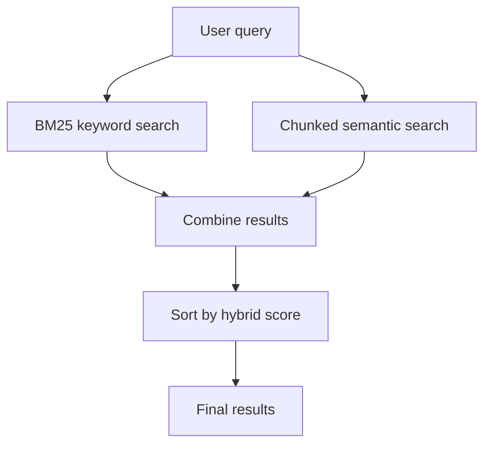

# Module 6: Hybrid Search

## Formula Summary

| Concept | Formula | Meaning |
| ------- | ------- | ------- |
| Min-max normalization | `(score - min_score) / (max_score - min_score)` | Converts scores to `0..1` within one result set |
| Equal-score normalization | if `min_score == max_score`, return `1.0` for every score | Avoids division by zero when all scores are tied |
| Weighted hybrid score | `alpha * bm25_score + (1 - alpha) * semantic_score` | Blends keyword and semantic evidence |
| RRF contribution | `1 / (k + rank)` | Gives higher-ranked results more credit |
| RRF score | `sum(1 / (k + rank_i))` | Adds rank evidence from multiple search systems |

Worked example for weighted search:

```text
# Normalise scores for each document
### normalised against set of scores for all documents in search result

Min-max normalization = (score - min_score) / (max_score - min_score)
normalized BM25 score = 0.80
normalized semantic score = 0.30
alpha = 0.70

hybrid_score = 0.70 * 0.80 + (1 - 0.70) * 0.30
             = 0.56 + 0.09
             = 0.65
```

Worked example for RRF:

```text
k = 60
BM25 rank = 2
Semantic rank = 5

rrf_score = 1 / (60 + 2) + 1 / (60 + 5)
          = 1 / 62 + 1 / 65
          = 0.0161 + 0.0154
          = 0.0315
```

## Lessons Learned

- **Keyword vs semantic search:** they fail differently.
  - Keyword search is better for exact titles, names, years, IDs, and rare strings.
  - Semantic search is better for topical or conceptual searches like "family friendly" or "survival in wilderness".
- **Hybrid search:** combines both systems.
  - It improves coverage because a query can benefit from either exact terms or semantic meaning.
  - **Candidate pools:** hybrid methods need more candidates than the final result limit.
    - A document may not be top 5 in either individual system but may become strong after combination.
  
  <u>Types of hybrid search:</u>
- **Weighted combination:** combines normalized scores.
  - BM25 scores and cosine scores are not directly comparable, so each list is normalized first (against set of scores for all documents in search results).
  - `alpha` controls the blend: higher alpha favors keyword evidence, lower alpha favors semantic evidence.
- **RRF:** combines ranks instead of scores.
  - It avoids raw-score comparability problems by rewarding documents that rank well in either system.
  - `k` controls how highly the top-ranked results get scored

---

## Setup and Context

By this point, the project has two independent search systems:

```text
Keyword search:
    query -> BM25 over inverted index -> ranked document IDs

Semantic search:
    query -> embedding -> cosine similarity over chunk embeddings -> ranked movie results
```

The course framing is practical: different query types benefit from different systems.

| Query type | Example | Usually better |
| ---------- | ------- | -------------- |
| Known item | `"The Revenant"` | Keyword |
| Year / exact string | `"2015"` | Keyword |
| Concept | `"family friendly"` | Semantic |
| Theme | `"survival movies"` | Semantic |
| Mixed | `"2015 family comedies"` | Hybrid |

Hybrid search makes the product more resilient because the user does not have to know which search engine their query needs.



---

## Core Hybrid Search Pipeline

### 1. Wrap keyword and semantic search behind one class

`HybridSearch` owns both retrieval systems:

```python
class HybridSearch:
    def __init__(self, documents: list[dict]) -> None:
        self.documents = documents
        self.semantic_search = ChunkedSemanticSearch()
        self.semantic_search.load_or_create_chunk_embeddings(documents)
        self.inverted_index = InvertedIndex()
```

It also ensures the keyword index exists:

```python
if not os.path.exists(self.inverted_index.index_path):
    self.inverted_index.build()
    self.inverted_index.save()
```

### 2. Normalize scores before weighted combination

BM25 scores and semantic cosine scores have different meanings and ranges. A BM25 score like `7.2` is not "seven times better" than a cosine score like `0.8`. Before combining them, the module normalizes each list separately.

```python
def normalize_score(*scores):
    score_list = list(scores)

    if not score_list:
        return []

    if min(score_list) == max(score_list):
        return [1.0] * len(score_list)

    max_score = max(score_list)
    min_score = min(score_list)
    return [(score - min_score) / (max_score - min_score) for score in score_list]
```

Worked example:

```text
scores = [10, 20, 30]

10 -> (10 - 10) / (30 - 10) = 0.0
20 -> (20 - 10) / (30 - 10) = 0.5
30 -> (30 - 10) / (30 - 10) = 1.0
```

The equal-score branch prevents:

```text
(score - min_score) / 0
```

### 3. Weighted search combines normalized evidence

Weighted search first asks each retriever for a large candidate pool:

```python
result_pool_size = limit * 500

bm25_results = self._bm25_search(query, result_pool_size)
semantic_results = self.semantic_search.search_chunks(query, result_pool_size)
```

The candidate pool is much larger than the final output because a document might be ranked moderately by both systems and still be excellent after combination.

The weighted score is:

```python
def hybrid_score(bm25_score: float, semantic_score: float, alpha: float = 0.5) -> float:
    return alpha * bm25_score + (1 - alpha) * semantic_score
```

Interpretation:

```text
alpha = 1.0 -> 100% keyword
alpha = 0.7 -> 70% keyword, 30% semantic
alpha = 0.5 -> even split
alpha = 0.2 -> 20% keyword, 80% semantic
alpha = 0.0 -> 100% semantic
```

The combining helper builds one dictionary keyed by document ID, so a document can receive both scores:

```python
combined_results[doc_id]["document"] = bm25_docmap[doc_id]
combined_results[doc_id]["bm25_score"] = normalized_score
```

Then semantic scores are added to the same document entries:

```python
combined_results[doc_id]["document"] = semantic_docmap[doc_id]
combined_results[doc_id]["semantic_score"] = max(
    combined_results[doc_id].get("semantic_score", 0.0),
    normalized_score,
)
```

The `max()` is specifically useful if the semantic side returns the same movie more than once from multiple chunks. The movie should keep its strongest chunk score.

Finally each document gets a `hybrid_score` and the list is sorted descending:

```python
result["hybrid_score"] = hybrid_score(
    result["bm25_score"],
    result["semantic_score"],
    alpha,
)
```

### 4. RRF combines ranks instead of raw scores

Weighted search still depends on score normalization. RRF solves a different problem: it combines rank positions directly.

```python
def calculate_rrf(rank: int, k: int) -> float:
    return 1 / (k + rank)
```

If a movie appears in both result lists, it receives credit from both:

```python
combined_results[doc_id]["rrf_score"] = (
    combined_results[doc_id].get("rrf_score", 0) + rrf_score
)
```

The RRF score means:

```text
high rank in BM25     -> adds keyword evidence
high rank in semantic -> adds semantic evidence
appears in both       -> gets both contributions
```

The `k` parameter controls how steeply top ranks are rewarded. With `k = 60`, rank differences still matter, but the scoring is not so steep that rank 1 completely dominates.

### 5. Missing ranks are represented explicitly

A document may appear in BM25 results but not semantic results, or the reverse. The implementation fills missing ranks with `"n/a"`:

```python
for result in combined_results.values():
    result["bm25_rank"] = result.get("bm25_rank", "n/a")
    result["semantic_rank"] = result.get("semantic_rank", "n/a")
```

This keeps output readable:

```text
BM25 Rank: 37, Semantic Rank: 1
BM25 Rank: 2, Semantic Rank: n/a
```

---

## Mental Model

Hybrid search is a way to avoid choosing one retrieval system too early.

```text
Keyword search:
    "Does the exact text match?"

Semantic search:
    "Does the meaning match?"

Weighted search:
    "Normalize both scores, then blend them with alpha."

RRF:
    "Ignore raw scores, reward documents for ranking well in either list."
```

Use weighted search when you trust the normalized score scales enough and want an explicit keyword/semantic dial. Use RRF when you want a robust default that combines rank positions without depending on raw-score calibration.

---

## Implementation Notes

Main files involved:

- `cli/lib/hybrid_search.py`
- `cli/hybrid_search_cli.py`
- `cli/lib/search_utils.py`
- `cli/lib/keyword_search.py`
- `cli/lib/chunked_semantic_search.py`

Relevant commits:

- `0237532 lesson 6.2`: added the hybrid search entrypoint and `HybridSearch` skeleton.
- `19339d1 lesson 6.3`: added score normalization and CLI support for normalization.
- `4352082 lesson 6.5`: added weighted search, `alpha`, larger candidate pools, and hybrid score output.
- `b7cb494 lesson 6.5`: added RRF search, RRF scoring, rank aggregation, and CLI output.

Useful commands:

```bash
uv run cli/hybrid_search_cli.py normalize 10 20 30
uv run cli/hybrid_search_cli.py weighted-search "family movie about bears" --alpha 0.5 --limit 5
uv run cli/hybrid_search_cli.py weighted-search "The Revenant" --alpha 0.8 --limit 5
uv run cli/hybrid_search_cli.py rrf-search "family movie about bears" --limit 5
uv run cli/hybrid_search_cli.py rrf-search "gods among mortals" -k 60 --limit 5
```
