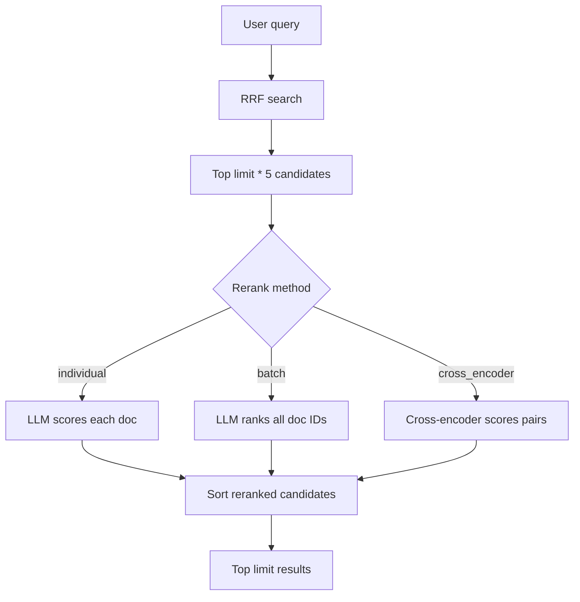

# Module 8: Reranking

Worked example:

```text
User asks for 3 results
RRF candidate pool = 3 * 5 = 15

Stage 1 - Fast search to narrow search space:
    BM25 + semantic + RRF -> 15 candidate movies

Stage 2 - slower, better search to sort the best ones:
    reranker scores/ranks those 15 movies

Final:
    return top 3 after reranking
```

## Lessons Learned

- **Reranking:** is a second-stage ranking step.
  - Fast retrieval finds plausible candidates first.
  - A slower reranker then improves the final top results.
- **How: Query-document judgment:** rerankers compare the query and candidate document more directly.
  - Vector search is fast because document embeddings are precomputed, but each vector is a compressed summary.
  - Reranking is better can look at the query and candidate document *together* to determine relevance. Better as can account for nuance, logical negations etc.
  
  <u>RERANKING METHODS:</u>
- https://sbert.net/examples/cross_encoder/applications/README.html
- **Individual LLM reranking:** scores one document at a time.
  - It is simple, but slow, expensive, and rate-limit prone.
- **Batch LLM reranking:** scores the candidate set together.
  - One prompt compares all candidates and returns ranked document IDs.
- **Cross-encoders:** are specialized rerankers.
  - They are usually faster and cheaper than full LLMs for relevance scoring.
  - Better as can fine-tune to your domain if have query/answer set to train on: https://www.ibm.com/think/topics/fine-tuning
  - In this project, they rerank a small RRF candidate set rather than search the full corpus.
  - Use Cohere API or competitors to start using re-ranker

---

## Setup and Context

The search system can already retrieve good candidates with RRF:

```text
query -> BM25 candidates
query -> semantic candidates
BM25 + semantic ranks -> RRF candidates
```

But users only see the first few results. If the best document is at rank 8, the search system still feels bad.

Reranking changes the flow:



The reason this works is that the expensive stage only sees a small candidate set, not the full movie database.

---

## Core Reranking Pipeline

### 1. Gather more candidates when reranking is enabled

The CLI increases the RRF limit when a rerank method is present:

```python
limit = args.limit * (5 if args.rerank_method else 1)
results = hybrid_search.rrf_search(args.query, args.k, limit)
```

After reranking, it truncates back to the requested display limit:

```python
unfilitered_results = rerank_results(args.rerank_method, args.query, results)
results = unfilitered_results[:args.limit]
```

This is the core two-stage shape:

```text
retrieve 15 -> rerank 15 -> display 3
```

not:

```text
retrieve 3 -> rerank 3
```

### 2. Individual LLM reranking scores one document at a time

Individual reranking sends one prompt per result:

```python
for result in results:
    document = result["document"]
    prompt = f"""Rate how well this movie matches the search query.

    Query: "{query}"
    Movie: {document.get("title", "")} - {document.get("description", "")}
    ...
    Rate 0-10 (10 = perfect match).
    Output ONLY the number in your response, no other text or explanation.
    """
```

The result receives a new score:

```python
llm_rank = get_rerank_score(prompt)
result["Re-rank Score"] = parse_rerank_score(llm_rank)
```

Then results are sorted descending:

```python
sorted_results = sorted(
    results,
    key=lambda item: item["Re-rank Score"],
    reverse=True,
)
```

This is easy to reason about, but it makes one API call per candidate.

### 3. Parse LLM scores defensively

The prompt asks for only a number, but LLMs can still return text. The code extracts the first valid `0..10` number:

```python
def parse_rerank_score(llm_rank: str) -> float:
    match = re.search(r"\b(?:10(?:\.0+)?|[0-9](?:\.\d+)?)\b", llm_rank)
    if match is None:
        return 0.0

    score = float(match.group())
    return max(0.0, min(10.0, score))
```

The regex accepts:

```text
10
10.0
9
8.5
0.25
```

The clamp prevents invalid values below `0` or above `10` from escaping into the ranking.

### 4. Batch LLM reranking compares candidates together

Batch reranking sends one prompt with all candidate documents:

```python
doc_list = []
for result in results:
    doc = result["document"]
    doc_list.append(
        f'{doc["id"]}. {doc.get("title", "")} - {doc.get("description", "")[:300]}'
    )
doc_list_str = "\n".join(doc_list)
```

The prompt asks for a raw JSON array of movie IDs:

```text
[75, 12, 34, 2, 1]
```

The code parses that response:

```python
llm_rank_list = json.loads(get_rerank_score(prompt))
```

Then it turns the ordered list into a rank lookup:

```python
rank_by_doc_id = {
    doc_id: rank
    for rank, doc_id in enumerate(llm_rank_list, start=1)
}
```

### 5. Handle missing LLM-ranked IDs without crashing

The LLM should return every candidate ID, but the batch reranker still gives omitted IDs a fallback rank:

The implementation uses an internal fallback sort key:

```python
fallback_rank = len(results) + 1

for original_rank, result in enumerate(results, start=1):
    doc_id = result["document"]["id"]
    result["_rerank_sort_key"] = rank_by_doc_id.get(
        doc_id,
        fallback_rank + original_rank,
    )
```

Documents omitted by the LLM are sorted after all explicitly ranked documents. The original RRF order is used only as a tie-breaker for omitted items.

After sorting, the displayed rank is made clean and gap-free:

```python
for display_rank, result in enumerate(sorted_results, start=1):
    result["Re-rank Rank"] = display_rank
    del result["_rerank_sort_key"]
```

### 6. Cross-encoder reranking scores query-document pairs directly

The earlier semantic search model is a bi-encoder:

```text
query -> embedding
document -> embedding
query embedding + document embedding -> cosine similarity
```

A cross-encoder sees both pieces at once:

```text
query + document -> model -> relevance score
```

The code builds all query-document pairs:

```python
pairs = []
for result in results:
    doc = result["document"]
    pairs.append([
        query,
        f"{doc.get('title', '')} - {doc.get('description', '')}",
    ])
```

Then it scores all pairs in one batch:

```python
cross_encoder = CrossEncoder("cross-encoder/ms-marco-TinyBERT-L2-v2")
scores = cross_encoder.predict(pairs)
```

The scores are attached and sorted:

```python
for result, score in zip(results, scores):
    result["Cross Encoder Score"] = float(score)

return sorted(
    results,
    key=lambda item: item["Cross Encoder Score"],
    reverse=True,
)
```

---

## Mental Model

Reranking is not a replacement for retrieval.

```text
Fast retrievers:
    BM25 + semantic + RRF
    -> find candidates

Slow rerankers:
    LLM or cross-encoder
    -> reorder candidates

Final output:
    top N after reranking
```

Bi-encoders are fast enough to search many documents. Cross-encoders and LLMs are more precise, so they are used after the candidate set is already small.

---

## Implementation Notes

Main files involved:

- `cli/lib/rerank_results.py`
- `cli/hybrid_search_cli.py`
- `cli/lib/search_utils.py`
- `semantic_search.md`

Relevant commits:

- `52cf76d lesson 8.2`: added individual LLM reranking, score parsing, rerank CLI option, and larger candidate pools.
- `7f76b30 add notes about 8.4 encoders`: added encoder notes and expanded reranking implementation work.
- `b0ed6e3 lesson 8.4`: added cross-encoder reranking and CLI support for `cross_encoder`.

Useful commands:

```bash
uv run cli/hybrid_search_cli.py rrf-search "family movie about bears in the woods" --rerank-method individual --limit 3
uv run cli/hybrid_search_cli.py rrf-search "family movie about bears in the woods" --rerank-method batch --limit 3
uv run cli/hybrid_search_cli.py rrf-search "family movie about bears in the woods" --rerank-method cross_encoder --limit 3
uv run cli/hybrid_search_cli.py rrf-search "not too scary family bear movie" --rerank-method batch --limit 5
```
