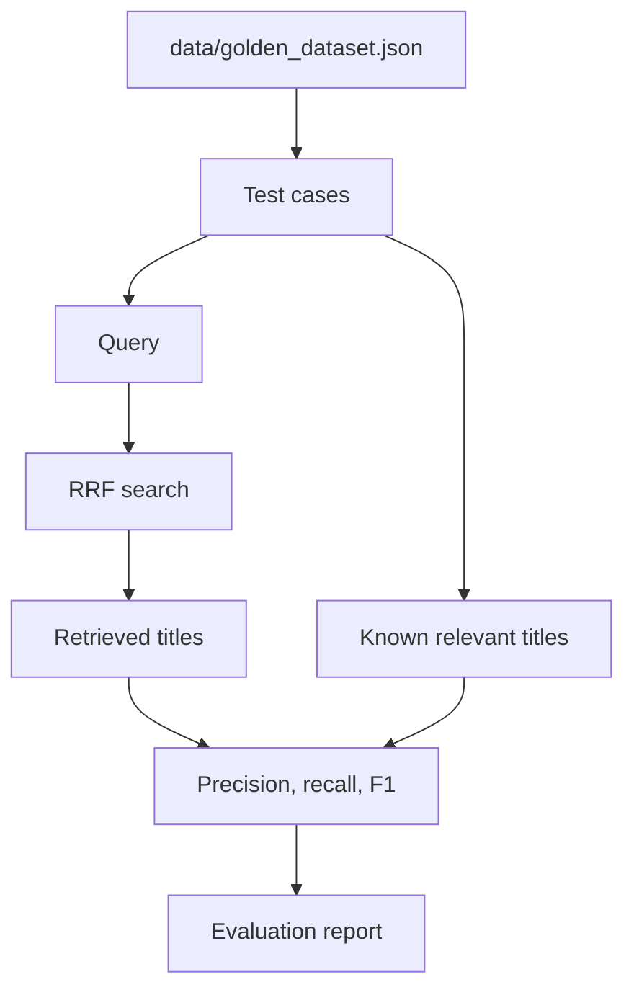

# Module 9: Evaluation

## Formula Summary

| Metric | Formula | Meaning |
| ------ | ------- | ------- |
| Precision | `relevant_retrieved / total_retrieved` | Of the results returned, how many were relevant? |
| Precision@K | relevant results in top `K` / `K` | Precision only over the visible top results |
| Recall | `relevant_retrieved / total_relevant` | Of all relevant documents, how many did we find? |
| Recall@K | relevant results in top `K` / known relevant docs | Completeness within the top `K` |
| F1 score | `2 * (precision * recall) / (precision + recall)` | Harmonic mean that rewards systems good at both |
| LLM judge score | `0, 1, 2, 3` | Qualitative relevance score returned by an LLM |

Worked example:

```text
Search returns 5 results.
3 of those results are relevant.
Golden dataset says 6 documents are relevant total.

precision@5 = 3 / 5 = 0.6000
recall@5 = 3 / 6 = 0.5000
f1 = 2 * (0.6 * 0.5) / (0.6 + 0.5)
   = 0.5455
```

## Lessons Learned

- **Manual evaluation:** search quality needs human inspection.
  - You cannot improve search reliably unless you can see how it performs.
  - Look at search results and see if it makes sense:
    - Did the results answer the question?
    - What is here that should not be? What is missing? Would I click these results?
    - Is it better to return fewer results because the rest are not useful, or would that miss relevant ones?
- **Golden datasets:** make evaluation repeatable.
  - Each test case pairs a real-ish query with known relevant documents.
- **Precision and recall:** measure different failures.
  - Precision asks: "How much of what we retrieved was useful?"
  - Recall asks: "How much of what was useful did we retrieve?"
  - Returning more results can improve recall while lowering precision.
  - Recall matters for thoroughness and pipeline performance in multi-stage systems.
  - Architecture example: were all relevant SEC filings retrieved?
- **F1:** rewards both high precision and recall, scoring overall performance of search results.
  - It is useful when both matter, but if one matters more, optimize that metric directly.
- **Error analysis:** explains metric changes.
  - Use Python's `logging` module for this.
  - Failures can come from any stage of search pipeline: preprocessing, query enhancement, keyword search, semantic search, reranking, or result cutoff.
  - Another example: search may fail differently on short queries versus long queries.
- **LLM judges:** can assist evaluation.
  - They can scale relevance scoring, but they are helpers rather than ground truth.
  - Ideally use domain experts, but LLMs can help with speed, scale, and cost when domain experts define the evaluation prompt and success criteria.

---

## Setup and Context

The project now has several ways to retrieve and rerank movies. Module 9 adds a way to judge whether changes are making the system better.

The first step is manual:

```text
Run a query.
Look at the results.
Ask:
    What is here that should not be?
    What is missing that should be?
    Would a user click these?
```

Then the module makes that repeatable with a golden dataset:



---

## Core Evaluation Pipeline

### 1. Start with manual evaluation

The course starts evaluation with a human check because relevance is not universal.

A query like:

```text
"dinosaur"
```

could technically match many animated dinosaur movies, but a streaming user may expect `Jurassic Park` to appear near the top. A metric can tell you the score dropped; manual inspection helps you understand whether the result set feels right.

Good manual questions:

```text
What is here that should not be?
What is missing that should be?
Would I click these results?
```

### 2. Use a golden dataset for repeatable checks

A golden dataset contains:

```text
query -> known relevant documents
```

The repo loads it through `search_utils.py`:

```python
GOLDEN_PATH = PROJECT_ROOT / "data" / "golden_dataset.json"

def load_test():
    with open(GOLDEN_PATH, "r") as f:
        data = json.load(f)
        return data["test_cases"]
```

Example shape:

```json
{
  "query": "cute british bear marmalade",
  "relevant_docs": ["Paddington"]
}
```

The value is consistency. Every search change can be tested against the same queries.

### 3. Precision@K measures result quality

Precision asks:

```text
Of the results I returned, how many were relevant?
```

Formula:

```text
precision = relevant_retrieved / total_retrieved
```

In code:

```python
relevant_result_count = 0

for title in result_titles:
    if title in answers:
        relevant_result_count += 1

precision = relevant_result_count / len(results)
```

If the top 5 results contain 2 relevant movies:

```text
precision@5 = 2 / 5 = 0.4000
```

Higher precision means less irrelevant material in the results.

### 4. Recall@K measures completeness

Recall asks:

```text
Of all the relevant documents, how many did I find?
```

Formula:

```text
recall = relevant_retrieved / total_relevant
```

In code:

```python
recall = relevant_result_count / len(answers)
```

If the golden dataset has 8 relevant movies and the top 5 results include 4 of them:

```text
recall@5 = 4 / 8 = 0.5000
```

Recall is especially important in multi-stage retrieval. A reranker cannot rescue a document that the first retrieval stage never returned.

### 5. F1 balances precision and recall

F1 is the harmonic mean:

```text
f1 = 2 * (precision * recall) / (precision + recall)
```

In code:

```python
f1 = 2 * (precision * recall) / (precision + recall)
```

F1 punishes imbalance:

| Precision | Recall | Arithmetic mean | F1 |
| --------- | ------ | --------------- | -- |
| 1.0 | 1.0 | 1.0 | 1.0 |
| 0.9 | 0.3 | 0.6 | 0.45 |
| 1.0 | 0.0 | 0.5 | 0.0 |

So a system with excellent precision but terrible recall does not look healthy under F1.

### 6. The evaluation CLI prints each test case

The evaluation command runs RRF search for each golden test:

```python
movies = load_movies()
tests = load_test()
hybrid_search = HybridSearch(movies)

for test in tests:
    query = test["query"]
    answers = test["relevant_docs"]
    results = hybrid_search.rrf_search(query, RRF_SEARCH_PARAMETER, limit)
```

Then it prints the metrics and the two title lists:

```python
print(f"- Query: {query}")
print(f"  - Precision@{limit}: {precision:.4f}")
print(f"  - Recall@{limit}: {recall:.4f}")
print(f"  - F1 Score: {f1:.4f}")
print("  - Retrieved:", ", ".join(result_titles))
print("  - Relevant:", ", ".join(answers))
```

### 7. Use logging for error analysis

Metrics tell you what changed. Logs help you find where it changed.

The repo configures debug logs like this:

```python
def setup_logging(debug: bool = False):
    if debug:
        logging.basicConfig(
            level=logging.DEBUG,
            filename=f"{LOGS_PATH}/RAG.log",
            filemode="w",
            encoding="utf-8",
            format="{asctime} - {levelname} - {message}",
            style="{",
            datefmt="%Y-%m-%d %H:%M",
        )
```

`filemode="w"` clears the log file on each run.

The hybrid CLI logs each result's title, BM25 rank, semantic rank, and RRF score:

```python
logger.debug(
    "Search result for the query: %s %s %s %s",
    result["document"]["title"],
    result["bm25_rank"],
    result["semantic_rank"],
    result["rrf_score"],
)
```

### 8. LLM evaluation scores result relevance

LLM evaluation asks a model to score each result against the query.

The repo builds a compact result list:

```python
formatted_results.append(
    f'{document.get("title", "")} - {document.get("description", "")[:300]}'
)
```

The prompt asks for JSON scores on a `0..3` scale:

```text
3 = highly relevant
2 = relevant
1 = marginally relevant
0 = not relevant
```

The response is parsed with:

```python
parsed_response = json.loads(llm_response)
```

Those scores are printed beside the search results:

```python
for i, result in enumerate(results, start=1):
    title = result["document"]["title"]
    print(f"{i}. {title}: {llm_eval[i - 1]}/3")
```

The LLM judge is useful for scale, but it should not be treated as ground truth. Surprising scores should still be spot-checked.

---

## Mental Model

Metric meanings:

```text
Precision:
    less junk

Recall:
    fewer missed relevant documents

F1:
    balanced precision and recall
```

Use all three: inspect results manually, track repeatable metrics, and use logs or LLM judges to find failure patterns faster.

---

## Implementation Notes

Main files involved:

- `data/golden_dataset.json`
- `cli/evaluation_cli.py`
- `cli/lib/evaluate_results.py`
- `cli/logging_config.py`
- `cli/hybrid_search_cli.py`
- `cli/lib/search_utils.py`
- `cli/logs/RAG.log`

Relevant commits:

- `31c2ff6 lesson 9.3`: added golden dataset loading and precision evaluation.
- `9ac5248 lesson 9.4`: added recall output.
- `24cd74f lesson 9.5`: added F1 score output.
- `dabac61` / `d5370d3 lesson 9.6`: added debug logging configuration and hybrid search logging.
- `7146c11` / `5180b7b lesson 9.7`: added LLM result evaluation and `--evaluate`.

Useful commands:

```bash
uv run cli/evaluation_cli.py --limit 5
uv run cli/evaluation_cli.py --limit 10
uv run cli/hybrid_search_cli.py rrf-search "family movie about bears in the woods" --evaluate
uv run cli/hybrid_search_cli.py rrf-search "dinosaur park" --limit 5 --evaluate
```
