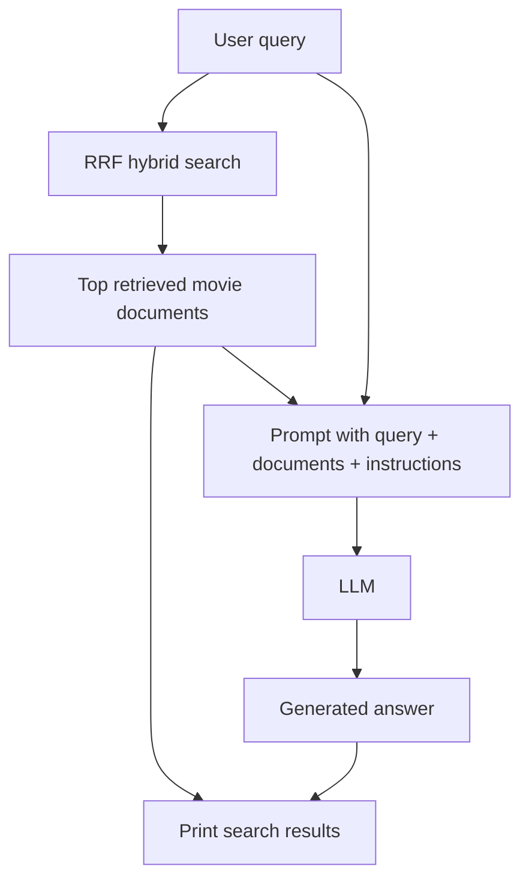

# Module 10: Augmented Generation

## Lessons Learned

- **RAG:** is the overall pattern.
  - Retrieve relevant documents.
  - Add those documents to the LLM context.
  - Generate an answer from that context.
- <u>AUGMENTED GENERATION:</u> 
- Example LLM prompts for each technique are in the `Core Augmented Generation Pipeline` section.
- **Summarization:** turns search results into user-facing guidance.
  - For Webflyx, that means useful movie suggestions for the user rather than an abstract summary.
- **Conflicts:** can appear across search results.
  - Types of conflicts include factual conflicts and opinion conflicts.
  - One way to get better performance: add an LLM step to detect conflicts before summarizing results.
- **Citations:** connect claims back to sources.
  - They improve trust because users can see which retrieved documents support the answer.
  - At the end of the summary, ask the LLM to cite the source metadata it grounded its answer on.
- **Question answering:** gives direct responses.
  - The user wants an answer to a question, not a list of search results.
  - Different questions need different approaches (that are highlighted in the prompt):
    - Factual: "When was The Revenant released?" → Direct answer
    - Analytical: "Which bear movies are most intense?" → Comparison required
    - Opinion: "What's the best bear movie?" → Subjective reasoning


---

## Setup and Context

Before this module, the project was a retrieval system:

```text
query -> search -> ranked movie documents
```

Module 10 adds generation:

```text
query -> search -> retrieved documents -> LLM prompt -> answer
```

That is the core RAG pipeline:



The LLM answer is grounded in the retrieved movie documents. The model may have broad background knowledge, but the application should make the retrieved context the authority.

---

## Core Augmented Generation Pipeline

### 1. Retrieve documents before calling the LLM

`rag_command()` loads the data, initializes hybrid search, runs RRF, then calls the LLM prompt helper:

```python
def rag_command(query: str) -> dict:
    movies = load_movies()
    hybrid_search = HybridSearch(movies)
    results = hybrid_search.rrf_search(query, RRF_SEARCH_PARAMETER, RRF_SEARCH_LIMIT)
    answer = rag(query, results)

    return {
        "search_results": [result["document"] for result in results],
        "answer": answer,
    }
```

The generated answer depends on `results`. This is what makes it RAG rather than a plain chatbot response.

### 2. Build context from retrieved documents

The basic RAG prompt formats retrieved documents as title plus a shortened description:

```python
formatted_results.append(
    f'{document.get("title", "")} - {document.get("description", "")[:300]}'
)
```

Then the prompt gives the model its role, the query, and the documents:

```python
prompt = f"""You are a RAG agent for Webflyx, a movie streaming service.
Your task is to provide a natural-language answer to the user's query based on documents retrieved during search.
Provide a comprehensive answer that addresses the user's query.

Query: {query}

Documents:
{formatted_results}

Answer:"""
```

### 3. Summarize multiple documents

The `summarize` command uses search results as the source material:

```python
def summarize_command(query: str, limit: int) -> dict:
    movies = load_movies()
    hybrid_search = HybridSearch(movies)
    results = hybrid_search.rrf_search(query, RRF_SEARCH_PARAMETER, limit)
    answer = summarize(query, results)
```

The prompt asks for a concise but information-dense synthesis:

```python
prompt = f"""Provide information useful to the query below by synthesizing data from multiple search results in detail.

The goal is to provide comprehensive information so that users know what their options are.
Your response should be information-dense and concise, with several key pieces of information about the genre, plot, etc. of each movie.

This should be tailored to Webflyx users. Webflyx is a movie streaming service.
...
Provide a comprehensive 3-4 sentence answer that combines information from multiple sources:"""
```

### 4. Understand conflicts in summaries

Documents may disagree in several ways:

```text
Factual conflict:
    one source says 2014, another says 2015

Opinion conflict:
    one source praises a movie, another criticizes it

Emphasis conflict:
    one source focuses on action, another focuses on emotion
```

Webflyx uses curated movie metadata, so this repo does not build a separate conflict-resolution step. The lesson is still important: summaries should not flatten disagreement into one false certainty.

### 5. Add citations for trust

A citation-aware answer needs numbered source documents:

```python
def format_citation_documents(results: list[dict]) -> list[str]:
    formatted_results = []
    for i, result in enumerate(results, start=1):
        document = result["document"]
        formatted_results.append(
            f'[{i}] {document.get("title", "")} - {document.get("description", "")}'
        )
    return formatted_results
```

The citation prompt tells the LLM to cite sources in `[1]`, `[2]` format:

```python
prompt = f"""Answer the query below and give information based on the provided documents.

The answer should be tailored to users of Webflyx, a movie streaming service.
If not enough information is available to provide a good answer, say so, but give the best answer possible while citing the sources available.

Query: {query}

Documents:
{formatted_results}

Instructions:
- Provide a comprehensive answer that addresses the query
- Cite sources in the format [1], [2], etc. when referencing information
- If sources disagree, mention the different viewpoints
- If the answer isn't in the provided documents, say "I don't have enough information"
- Be direct and informative

Answer:"""
```

The citation number only works because the documents are explicitly numbered before being sent to the model. The LLM will not reliably infer stable citation numbers unless the prompt gives it stable source labels.

### 6. Add conversational question answering

Question answering is the most direct RAG experience:

```text
User:
    "What year was The Revenant released?"

Search:
    retrieves relevant movie docs

RAG answer:
    "2015"
```

The command function is parallel to `summarize_command()`:

```python
def question_command(question: str, limit: int) -> dict:
    movies = load_movies()
    hybrid_search = HybridSearch(movies)
    results = hybrid_search.rrf_search(question, RRF_SEARCH_PARAMETER, limit)
    answer = answer_question(question, results)
```

The prompt asks for a direct, casual answer:

```python
prompt = f"""Answer the user's question based on the provided movies that are available on Webflyx, a streaming service.

Question: {question}

Documents:
{context}

Instructions:
- Answer questions directly and concisely
- Be casual and conversational
- Don't be cringe or hype-y
- Talk like a normal person would in a chat conversation

Answer:"""
```

---

## Mental Model

RAG adds a generation layer to retrieval:

```text
Retrieve:
    find relevant documents

Augment:
    put those documents into the prompt

Generate:
    ask the LLM to answer from that context
```

The core safety rule:

```text
The answer can only be as trustworthy as the retrieved context and the prompt instructions.
```

---

## Implementation Notes

Main files involved:

- `cli/augmented_generation_cli.py`
- `cli/lib/rag_prompt.py`
- `cli/lib/summarize_command.py`
- `cli/lib/hybrid_search.py`
- `cli/lib/rerank_results.py`
- `cli/lib/search_utils.py`

Relevant commits:

- `4b228d2 lesson 10.1`: added initial RAG CLI and `rag_command`.
- `71d9f5f lesson 10.2`: added summarization command and LLM summarization helper.
- `78dbabd lesson 10.4`: added citation-aware answers and citation document formatting.
- `3deb077 lesson 10.5`: added conversational question answering.

Useful commands:

```bash
uv run cli/augmented_generation_cli.py rag "dinosaur park"
uv run cli/augmented_generation_cli.py summarize "bear movies for kids" --limit 5
uv run cli/augmented_generation_cli.py citations "space adventure" --limit 5
uv run cli/augmented_generation_cli.py question "What are some family-friendly bear movies?" --limit 5
```
