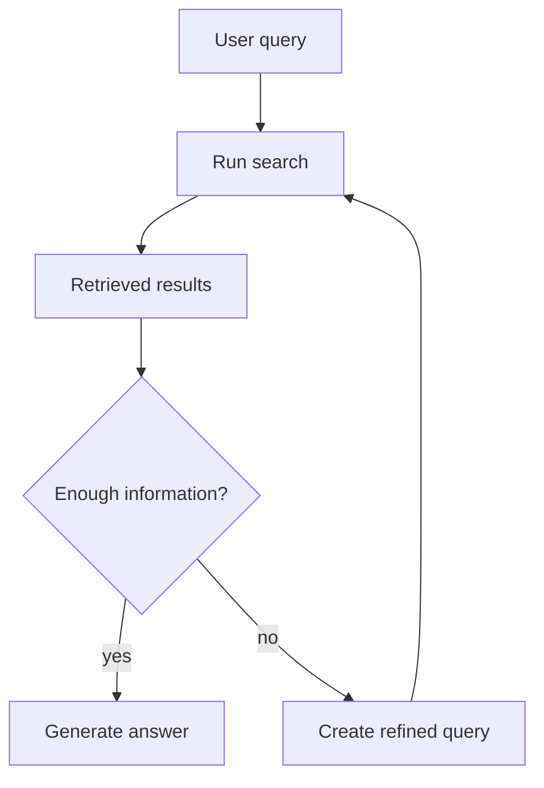

# Module 11: Agentic

## Lessons Learned

- **Recursive RAG:** is the first idea.
  - It uses what the first search found, or failed to find, to guide the next search.
- **Agentic search:** is the main extension.
  - It is a loop where an LLM chooses which tool to use next based on previous results.
- **When to use it:** use agentic search when the query needs multi-step investigation.
  - It is more flexible than a fixed RAG pipeline.
  - It is slower because it may run multiple searches and LLM calls.
  - A simple query should not need a full agent loop.
- **Module 11:** is conceptual in this repo.
  - The course explains the idea, but no dedicated agentic RAG implementation was added.

---

## Recursive RAG

Normal RAG does one retrieval pass:

```text
query -> search -> documents -> answer
```

Recursive RAG adds another step when the first results are incomplete.

Example:

```text
Question:
    "What's the budget of the highest-grossing bear movie?"

First search:
    "highest-grossing bear movie"
    -> finds that The Jungle Book made a lot of money

Problem:
    the user asked for budget, not revenue

Second search:
    "The Jungle Book production budget"
    -> searches for the missing detail
```

Each search can teach the system what to search for next.



---

## Agentic Search

Agentic search generalizes recursive RAG. Instead of hardcoding one search step, the system gives the LLM tools and lets it choose what to run next.

The basic loop:

```python
while not done:
    tool = pick_next_tool(previous_results)
    results = tool.search(query)
    previous_results.append(results)
```

The selection function is:

```python
pick_next_tool(previous_results)
```

It decides what to do next based on what has already been found.

Possible tools from the lesson:

- Keyword search: find movies by keywords.
- Semantic search: search by meaning.
- Regex search: match text patterns like `"bear attack"` or `"wilderness survival"`.
- Genre search: filter by genres like horror, adventure, or drama.
- Actor search: find movies starring specific actors.

Example query:

```text
"Find scary bear movies that were in a forest"
```

Possible agentic flow:

```text
1. Use genre search to narrow down to horror/thriller movies.
2. Use regex search to find bear-related titles.
3. Use another regex search for forest mentions.
4. Use semantic search for related terms like wilderness or survival.
5. Generate a summary with citations from the gathered results.
```

The order is chosen for the specific query and previous results, rather than being preprogrammed.

---

## Mental Model

```text
RAG:
    one planned retrieval pipeline

Recursive RAG:
    search, inspect, then search again if needed

Agentic search:
    let the LLM choose tools in a loop
```

Agentic search is more intelligent and flexible, but it is also slower. Use it when the query requires multi-step investigation, not when one good search is enough.

---

## Implementation Notes

No dedicated Module 11 implementation commits were found in this repo. The module is conceptual and builds on the previous retrieval, reranking, and RAG pieces.
